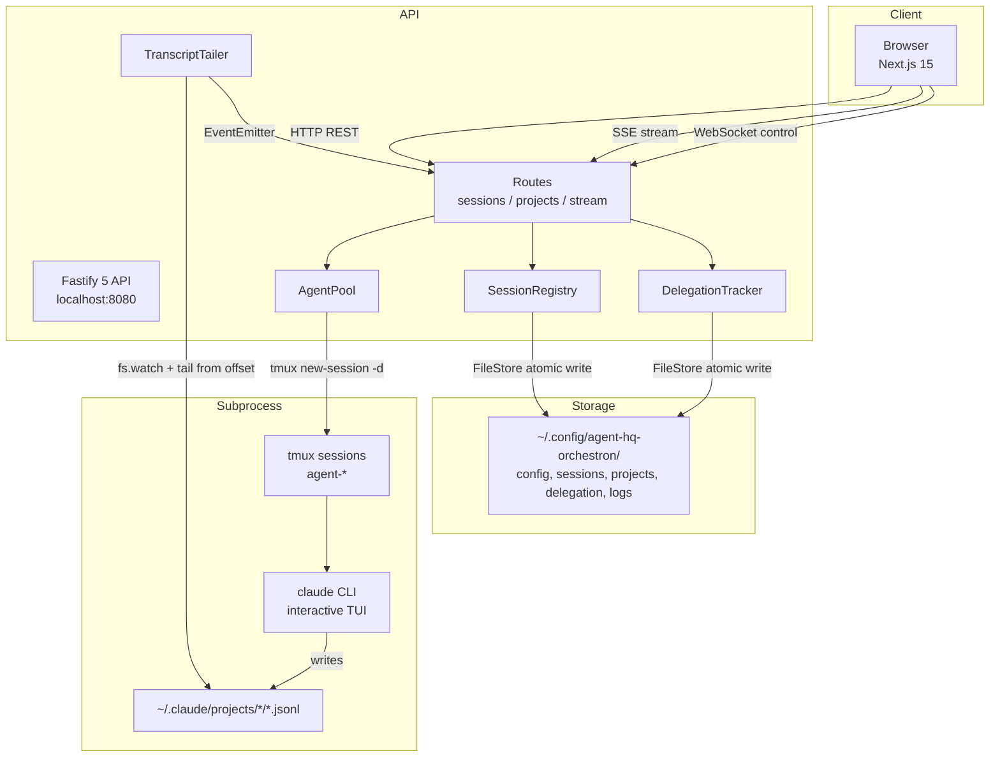
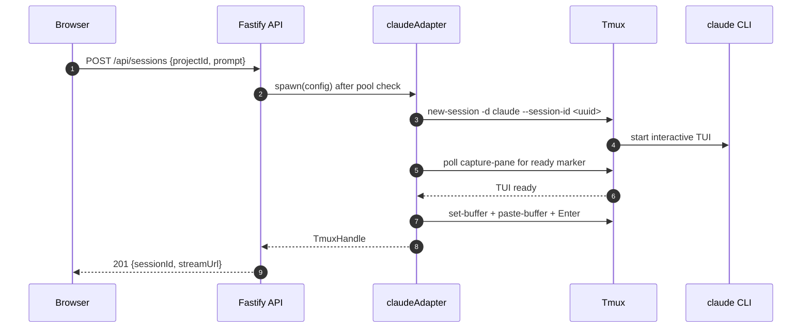
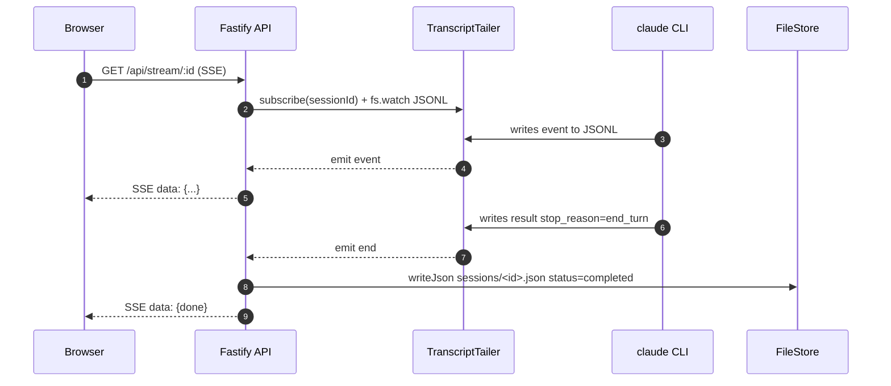
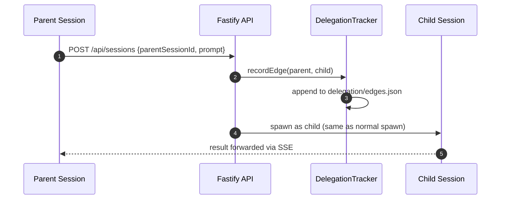

# agent-hq-orchestron - High-Level Design

| Attribute | Value |
|-----------|-------|
| **Date** | 2026-08-15 |
| **Status** | Draft |
| **Version** | 1.0 |
| **Author** | Adi Novriansyah |
| **Reference** | Tycho ([firewalker06/tycho](https://github.com/firewalker06/tycho)), claude-cli-bridge (`~/Codes/claude-cli-bridge/`), nafu-bg-claude |

---

## Table of Contents

- [Overview](#overview)
- [Impacted Applications](#impacted-applications)
- [Requirements Overview](#requirements-overview)
- [Technical Implementation](#technical-implementation)
- [System Architecture](#system-architecture)
- [Data Flow & Privacy](#data-flow--privacy)
- [Testing Strategy](#testing-strategy)
- [Risk, Limitations & Out of Scope](#risk-limitations--out-of-scope)
- [Deployment Plan](#deployment-plan)
- [Open Items](#open-items)
- [Assumptions](#assumptions)
- [Revision History](#revision-history)

---

## Overview

`agent-hq-orchestron` adalah web-based supervisor untuk coding agents (Claude, Codex, OpenCode) — reimplementasi konsep [Tycho](https://github.com/firewalker06/tycho) ke stack TypeScript full-stack (Next.js 15 + Fastify 5) dengan penyimpanan file-based (JSON + JSONL). Berjalan lokal per-user, spawn CLI agent sebagai subprocess interaktif via tmux — menggunakan subscription quota (Claude Pro/Max), **bukan** `claude -p` API credit.

### Background

Tycho open-source (MIT, Ruby 3.2) menawarkan pola "Factorio for coding agents" — dashboard TUI untuk manage banyak agent session concurrent, dengan parent-child delegation dan file-based state. Tapi ada gap untuk use case Adi:

1. Stack Ruby tidak konsisten dengan preferensi TS Adi
2. UI hanya TUI — tidak ada visualisasi graph orkestrasi
3. Distribusi Homebrew-only, tidak native untuk workflow Linux
4. Tidak reuse pola OpenClaw yang sudah proven (`claude-cli-bridge`, `nafu-bg-claude`)

Fitur ini membangun equivalent web-based dengan pola pattern yang sudah proven di ekosistem OpenClaw, dan menutup gap visualisasi DAG orkestrasi.

### Goals

- Supervisor web UI untuk manage banyak Claude/Codex session concurrent (single user, localhost)
- Reuse tmux + interactive CLI subprocess pattern → subscription quota, bukan API credit
- File-based storage (JSON + JSONL append-only, atomic write + `.bak` backup) untuk zero-ops deployment
- Visualisasi DAG parent-child delegation via React Flow
- Extensible ke CLI lain (Codex, OpenCode, Aider) via adapter pattern

### Non-Goals

- Multi-user / auth / team dashboard (single-user desktop tool)
- Cloud deployment (fully local; remote access via Tailscale/ngrok user's own choice)
- Windows native support (macOS + Linux via tmux; Windows via WSL)
- `claude -p` / Anthropic SDK direct mode — **EXPLICITLY EXCLUDED** (consume API credit)
- PostgreSQL / Redis / message queue — SKIP dulu, cukup file-based

---

## Impacted Applications

| Application | Impact Type | Description |
|-------------|-------------|-------------|
| `@agent-hq-orchestron/web` (Next.js 15) | **New** | Web UI: dashboard, session detail view, orchestration DAG, project registry |
| `@agent-hq-orchestron/api` (Fastify 5) | **New** | REST + SSE + WebSocket API, spawn `claude` subprocess via tmux, tail JSONL transcript |
| `@agent-hq-orchestron/shared` | **New** | Shared TypeScript types + Zod schemas antara FE ↔ BE |
| `@agent-hq-orchestron/file-store` | **New** | TS port dari Tycho `HQ::FileStore` — atomic write, `.bak` backup, JSONL append |
| `~/Codes/claude-cli-bridge/` | Reference | Baca sebagai pattern reference (tidak dimodifikasi) |
| `~/.local/bin/nafu-bg-claude` | Reference | Pattern reference untuk tmux spawn + JSONL tail |
| `~/.claude/projects/<cwd>/*.jsonl` | Read-only consumed | Tail untuk streaming session transcript ke browser |

---

## Requirements Overview

### Functional Requirements

| ID | Requirement | Priority |
|----|-------------|----------|
| FR-01 | User dapat spawn Claude session dari web UI dengan initial prompt + agent config | Must Have |
| FR-02 | Setiap session di-track: status (active/waiting/completed/failed), tmux name, JSONL path, token usage, cost | Must Have |
| FR-03 | Real-time stream event JSONL dari `claude` ke browser via Server-Sent Events (SSE) | Must Have |
| FR-04 | User dapat lihat parent-child session (delegation) sebagai directed graph di React Flow | Must Have |
| FR-05 | User dapat kill running session dari UI (`tmux kill-session`) | Must Have |
| FR-06 | Session history persist across restart — resume via `claude --resume <uuid>` | Must Have |
| FR-07 | User dapat register project (path folder) sebagai workspace untuk session | Must Have |
| FR-08 | Pool limit — max N concurrent subprocess (configurable, default 20), reject spawn kalau full | Should Have |
| FR-09 | Session search / filter UI (by project, status, date, tag) | Should Have |
| FR-10 | Support CLI adapter Codex, OpenCode, Aider via config-driven adapter | Nice to Have |
| FR-11 | Scheduled agent runs (cron-style, mirip Tycho `schedules/`) | Nice to Have |

### Non-Functional Requirements

| ID | Requirement | Target |
|----|-------------|--------|
| NFR-01 | Session spawn latency (tmux boot + TUI ready + first paste) | < 3s p95 |
| NFR-02 | JSONL event streaming latency (transcript write → browser paint) | < 200ms p95 |
| NFR-03 | Max concurrent subprocess | 20 (configurable) |
| NFR-04 | Storage durability | Atomic write + `.bak` recovery, no corruption on `kill -9` |
| NFR-05 | Portability | Copy `~/.config/agent-hq-orchestron/` = full backup + restore |
| NFR-06 | Dev bootstrap | `npm install && npm run dev` → running dalam < 60s |
| NFR-07 | Cost | Nol API credit consumed — verify via Anthropic dashboard |
| NFR-08 | Availability | Best-effort local; process supervisor via systemd user unit opsional |

---

## Technical Implementation

### Overview

Pendekatan: full-TypeScript monorepo (npm workspaces + Turborepo), dua aplikasi (`web` Next.js, `api` Fastify) + dua package internal (`shared` types, `file-store` atomic-write). Backend spawn `claude` CLI sebagai subprocess interaktif via `tmux new-session -d`, kemudian tail JSONL transcript (`~/.claude/projects/<cwd>/<uuid>.jsonl`) dari offset pre-spawn, emit event stream via SSE ke browser. Frontend render dashboard list, session detail dengan log stream, dan DAG parent-child pakai React Flow.

Pattern spawn identik dengan `claude-cli-bridge` dan `nafu-bg-claude` — sudah proven di production Adi. Yang berbeda: bridge Python di reference itu spawn on-demand + kill setelah selesai; di sini session dibiarkan hidup di tmux sampai user explicit kill atau `stop_reason=end_turn` terdeteksi.

### Key Components

#### Component 1: `@agent-hq-orchestron/web` (Next.js 15 Frontend)

- **Purpose:** Web UI untuk manage session, visualisasi DAG delegation, project registry
- **Technology:** Next.js 15 App Router, React 18, shadcn/ui, Tailwind CSS, `@xyflow/react` (React Flow), Zustand (client state), `@tanstack/react-query` (server state), native `EventSource` untuk SSE
- **Changes Required:** All new — pages: `/` (dashboard), `/session/[id]`, `/graph`, `/projects`, `/settings`

#### Component 2: `@agent-hq-orchestron/api` (Fastify Backend)

- **Purpose:** REST + streaming API, subprocess pool management, transcript tailing, delegation tracking
- **Technology:** Fastify 5, TypeScript, `@fastify/sensible`, `@fastify/websocket`, `pino` logger
- **Changes Required:** All new. Services:
  - `AgentPool` — Map<sessionId, AgentProcess>, enforce max concurrent, kill on-demand
  - `SessionRegistry` — CRUD session metadata via FileStore
  - `TranscriptTailer` — watch JSONL from offset, emit events via EventEmitter
  - `DelegationTracker` — parent-child edges (source-of-truth JSON, in-memory index)
  - Adapters: `claudeAdapter`, `codexAdapter` (Phase 3), `opencodeAdapter` (Phase 3)

#### Component 3: `@agent-hq-orchestron/file-store` (Storage Library)

- **Purpose:** Atomic file operations mirroring Tycho `HQ::FileStore` semantics
- **Technology:** Node.js `fs` + `write-file-atomic` + `proper-lockfile`
- **Changes Required:** All new. API:
  - `writeJson(path, value)` — tmp file → fsync → rename + fsync_dir, backup `.bak`
  - `readJson(path, fallback)` — try main, fall back to `.bak` on JSON parse error
  - `appendJsonl(path, event)` — append-only line
  - `readJsonlFrom(path, offset)` — read from byte offset ke EOF
  - Vitest coverage untuk concurrent write safety

#### Component 4: `@agent-hq-orchestron/shared` (Types + Schemas)

- **Purpose:** Shared TypeScript interfaces + Zod validation schemas
- **Technology:** TypeScript, Zod
- **Changes Required:** All new. Contains: `SessionMetadata`, `AgentAdapter`, `SpawnConfig`, `SessionEvent`, `DelegationEdges`

### API Changes

#### New Endpoints

| Method | Endpoint | Description |
|--------|----------|-------------|
| GET | `/api/health` | Liveness — check tmux + storage writable |
| POST | `/api/sessions` | Spawn new session |
| GET | `/api/sessions` | List sessions (filter: status, projectId, date range) |
| GET | `/api/sessions/:id` | Get session detail (metadata + latest events) |
| DELETE | `/api/sessions/:id` | Kill running session (`tmux kill-session`) |
| POST | `/api/sessions/:id/input` | Send follow-up prompt ke running session |
| GET | `/api/stream/:id` | **SSE** — stream JSONL events dari session's transcript |
| GET | `/api/graph` | Full delegation graph `{ nodes, edges }` |
| GET | `/api/projects` | List registered projects |
| POST | `/api/projects` | Register new project |
| WS | `/api/control/:id` | WebSocket — bidirectional control (kill, follow-up) |

#### Request/Response Examples

**POST /api/sessions**

Request:

```json
{
  "projectId": "proj-abc123",
  "agentType": "claude",
  "model": "claude-sonnet-4-6",
  "initialPrompt": "Refactor the payment service tests",
  "parentSessionId": null
}
```

Response (201 Created):

```json
{
  "id": "sess-xyz789",
  "projectId": "proj-abc123",
  "agentType": "claude",
  "status": "active",
  "parentSessionId": null,
  "claudeSessionUuid": "550e8400-e29b-41d4-a716-446655440000",
  "tmuxName": "agent-a1b2c3d4",
  "jsonlPath": "/home/adi/.claude/projects/-home-adi-Works-x/550e8400-....jsonl",
  "startedAt": "2026-08-15T10:30:00Z",
  "streamUrl": "/api/stream/sess-xyz789"
}
```

**GET /api/stream/:id** (Server-Sent Events)

```
data: {"type":"assistant","content":"I'll start by reading the test file..."}

data: {"type":"tool_use","name":"Read","input":{"file_path":"tests/payment.test.ts"}}

data: {"type":"tool_result","output":"..."}

data: {"type":"result","stop_reason":"end_turn","tokens":{"input":1234,"output":567}}
```

### Storage Layout (File-Based)

Storage root: `~/.config/agent-hq-orchestron/`

```
~/.config/agent-hq-orchestron/
├── config/
│   ├── hq.yml                        # Projects, agent templates, defaults (YAML)
│   └── hq.yml.bak
├── sessions/
│   ├── <session-uuid>.json           # Session metadata
│   ├── <session-uuid>.json.bak
│   └── <session-uuid>.jsonl          # Append-only event log (mirror of Claude JSONL)
├── projects/
│   ├── <project-uuid>.json
│   └── <project-uuid>.json.bak
├── delegation/
│   └── edges.json                    # Parent-child adjacency list
└── logs/
    └── api-YYYY-MM-DD.log            # API server log
```

**No SQL database.** Semua state adalah file. Query pattern:
- List sessions = scan `sessions/*.json` (acceptable sd ~10K session; migrate ke SQLite Phase 2 kalau perlu)
- Filter by status = scan + JSON parse (bisa cached di memory)
- Full-text search = grep atau in-memory index (Phase 3)

**Data model TypeScript:**

```typescript
interface SessionMetadata {
  id: string
  projectId: string
  agentType: 'claude' | 'codex' | 'opencode'
  status: 'active' | 'waiting' | 'completed' | 'failed'
  parentSessionId: string | null
  claudeSessionUuid: string
  tmuxName: string
  jsonlPath: string
  initialPrompt: string
  finalResponse: string | null
  tokenUsage: { input: number; output: number } | null
  costUsd: number | null
  startedAt: string
  endedAt: string | null
  metadata: Record<string, unknown>
}

interface DelegationEdges {
  version: 1
  edges: Array<{ parent: string; child: string; createdAt: string }>
}
```

### CLI Adapter Contract

Kritikal — **HANYA interactive TUI mode via tmux**, tidak boleh `claude -p`:

```typescript
export interface AgentAdapter {
  name: string
  spawn(config: SpawnConfig): Promise<TmuxHandle>
  resume(sessionUuid: string, config: ResumeConfig): Promise<TmuxHandle>
  sendPrompt(handle: TmuxHandle, prompt: string): Promise<void>
  waitTuiReady(handle: TmuxHandle, timeoutMs: number): Promise<void>
  kill(handle: TmuxHandle): Promise<void>
}

// apps/api/src/adapters/claude.ts
export const claudeAdapter: AgentAdapter = {
  name: 'claude',
  async spawn(config) {
    const tmuxName = `agent-${randomId(8)}`
    const claudeUuid = crypto.randomUUID()

    // JANGAN pake -p / --print. Interactive TUI only.
    await execFile('tmux', [
      'new-session', '-d', '-s', tmuxName,
      '-x', '220', '-y', '50',
      '-c', config.workspace,
      'env', `CLAUDE_CONFIG_DIR=${config.configDir}`,
      'claude',
      '--model', config.model,
      '--permission-mode', 'bypassPermissions',
      '--session-id', claudeUuid,
    ])

    return { tmuxName, claudeUuid, jsonlPath: resolveJsonlPath(config, claudeUuid) }
  },
  // sendPrompt: tmux set-buffer + paste-buffer + Enter
  // waitTuiReady: poll capture-pane sampai detect ❯ / │ > / ? for shortcuts
  // kill: tmux kill-session -t <name>
}
```

**Enforcement:** Adapter contract test verify argv **tidak pernah** mengandung `-p` atau `--print`. Runtime assertion sebelum spawn.

---

## System Architecture

### Architecture Diagram



**Architecture Explanation:**
1. **Client (Browser):** Next.js 15 App Router. Dashboard grid, session detail dengan live log stream, DAG orchestration graph pakai React Flow.
2. **API (Fastify):** Single Node process, port 8080. Routes handle CRUD + SSE. Services orchestrate subprocess pool, storage, dan transcript tailing.
3. **Storage (File-Based):** Semua state di `~/.config/agent-hq-orchestron/`. Atomic write + `.bak` backup. No SQL DB.
4. **Subprocess (tmux + claude):** Setiap session = 1 detached tmux session menjalankan `claude` interaktif. TranscriptTailer watch JSONL yang di-write Claude ke `~/.claude/projects/`.

### Sequence Diagram - Session Spawn (Phase A: Boot + Prompt)



**Step Explanation (Phase A):**
1. Browser POST spawn request dengan project + prompt awal
2. Fastify check pool capacity (max concurrent 20), delegate ke `claudeAdapter.spawn`
3. Adapter jalankan `tmux new-session -d ... claude --model X --session-id <uuid>` (**interactive, bukan `-p`**)
4. Claude CLI start di detached tmux, render TUI
5. Adapter poll `tmux capture-pane` untuk deteksi prompt marker
6. TUI ready terdeteksi
7. Adapter paste prompt via `tmux set-buffer + paste-buffer` lalu `send-keys Enter`
8. Adapter return TmuxHandle ke Fastify
9. API return `201` dengan session detail + `streamUrl`

### Sequence Diagram - Session Spawn (Phase B: Stream + Complete)



**Step Explanation (Phase B):**
1. Browser subscribe SSE endpoint `/api/stream/:id`
2. Fastify register subscription di TranscriptTailer, mulai `fs.watch` pada JSONL path Claude
3. Claude write event ke JSONL (assistant, tool_use, tool_result)
4. Tailer detect + emit event ke Fastify
5. Fastify push SSE `data: {...}` ke Browser
6. Claude write result dengan `stop_reason=end_turn`
7. Tailer detect end + emit
8. Fastify update session metadata status ke `completed` via FileStore atomic write
9. Fastify push SSE `done` marker + close stream; kill tmux session

### Sequence Diagram - Parent-Child Delegation



**Step Explanation:**
1. Parent session POST spawn request dengan `parentSessionId` field
2. Fastify record edge di `DelegationTracker`
3. Tracker atomic-append edge ke `delegation/edges.json`
4. Fastify spawn child session (flow sama seperti sequence A + B di atas)
5. Child result di-forward ke parent's SSE stream — parent bisa lihat sub-session progress. Graph endpoint aggregate edges + node metadata untuk React Flow rendering.

---

## Data Flow & Privacy

### Data Classification

| Data | Classification | Location | Handling |
|------|---------------|----------|----------|
| Session prompts | User content | `~/.config/agent-hq-orchestron/sessions/*.jsonl` | File permission 0o600, no upload |
| Session responses | User content + code | `~/.claude/projects/*/*.jsonl` (Claude's dir) + our sessions/*.jsonl | 0o600 |
| Claude session UUID | Internal ID | Session metadata JSON | 0o600 |
| Anthropic API key | Sensitive | Not stored — Claude CLI manages own auth | N/A |
| Project paths | User workspace | `projects/*.json` | 0o600 |

**All data local-only.** No external service. No telemetry. No cloud upload.

### File Permission

Semua file yang di-write oleh FileStore pakai mode `0o600` (owner read/write only). Directory `~/.config/agent-hq-orchestron/` pakai mode `0o700`. Sesuai pattern Tycho.

---

## Testing Strategy

### Test Pyramid

| Layer | Coverage | Tool | Kritis? |
|-------|----------|------|---------|
| Unit | FileStore atomic write, adapter argv assertion, DAG builder, Zod schema | Vitest | Yes |
| Integration | Spawn tmux → wait TUI ready → paste prompt → assert JSONL event emit | Vitest + real tmux | Yes |
| E2E | Register project → spawn session → watch stream → kill | Playwright | Should |
| Contract | Zod validation FE↔BE, adapter interface conformance | Zod + Vitest | Yes |

### Kritikal Test Cases

1. **FileStore concurrent write** — 2 process write ke path yang sama, assert atomic rename tidak corrupt data
2. **Adapter argv assertion** — verify tidak pernah ada `-p` / `--print` di argv spawn
3. **Tailer offset persistence** — restart API mid-session, resume dari offset lama, assert no duplicate emit
4. **Tmux crash recovery** — SIGKILL tmux session → status auto-transition ke `failed`
5. **JSONL malformed line** — tailer tetap continue, log warning, skip line

---

## Risk, Limitations & Out of Scope

### Out of Scope (Current Design)

| Item | Reason | Future Consideration |
|------|--------|---------------------|
| Multi-user / auth | Single-user local desktop tool | Phase 4 (if converted to team product) |
| Cloud deployment | Fully local; agents butuh filesystem access | User can use Tailscale for remote access |
| Windows native | Depends on tmux | WSL supported; native via `node-pty` in Phase 3 |
| `claude -p` mode | Consume API credit (Adi's cost constraint) | Never planned |
| Postgres/Redis | Overkill for single-user | Phase 2 migration path to SQLite documented |
| Anthropic SDK direct | Same as `-p` — API credit | Never planned |
| Encrypted storage | Local-only; user's own machine security | User can encrypt `~/.config/` via LUKS/FileVault |

### Design Limitations

| Limitation | Impact | Workaround | Future Improvement |
|------------|--------|------------|-------------------|
| File-based storage tidak scale ke > 10K session | List/filter slow (full scan) | Cap history retention di config, atau archive | Migrate ke SQLite (better-sqlite3 + Drizzle) di Phase 2 |
| Single-machine only | No distributed session | User run instance per machine | Out of scope |
| No live collaboration | State per user | N/A | Out of scope |
| Windows native tidak didukung | Windows user pakai WSL | WSL2 supported | Node-pty adapter Phase 3 |
| Tmux dependency | Butuh tmux ≥ 3.0 di system | README prerequisites clear | Alternative node-pty adapter |
| Session state kalau OS restart | Semua tmux session hilang | Manual `--resume` untuk continue | systemd user service opsional untuk auto-restore |

### Known Risks

| ID | Risk | Probability | Impact | Mitigation | Status |
|----|------|-------------|--------|------------|--------|
| R-01 | Tmux TUI ready detection race condition | Medium | Session spawn timeout | Poll capture-pane dengan regex `❯` / `│ >`, retry paste sd 3x (proven pattern bridge.py) | Open |
| R-02 | Claude JSONL schema berubah upstream | Low | Tailer parse error | Zod validation dengan fallback ke raw text; version pin di README | Open |
| R-03 | Concurrent write ke `edges.json` (2 subprocess selesai bareng) | Medium | File corrupt | Atomic write + `proper-lockfile` advisory lock | Open |
| R-04 | Filesystem full → JSONL append gagal | Low | Session data lost | Pre-check disk space, log warning, dispatch alert | Open |
| R-05 | `claude` CLI upgrade break `--session-id` semantic | Medium | Resume broken | Pin CLI version di README + regression test suite | Open |
| R-06 | Accidental `claude -p` di adapter → tagihan API credit | Low | Cost incident | Adapter contract test: argv assertion; runtime pre-spawn assertion | Open |
| R-07 | Session hijack — user attach ke tmux + type manual | Low | State corrupt | Mark session failed; document expected behavior | Open |
| R-08 | Web UI exposed ke network tanpa auth | Medium | Unauthorized spawn | Bind default ke `127.0.0.1` only; require explicit `--host 0.0.0.0` flag + warning | Open |

---

## Deployment Plan

### Prerequisites

- [ ] Node.js ≥ 20 (LTS) — check via `.nvmrc`
- [ ] npm ≥ 10
- [ ] tmux ≥ 3.0
- [ ] `claude` CLI installed + authenticated dengan Adi's Claude Pro/Max subscription
- [ ] `~/.claude/` dan `~/.config/agent-hq-orchestron/` writable
- [ ] OS: macOS atau Linux (Windows via WSL only)

### Deployment Phases

| Phase | Description | Rollback Point |
|-------|-------------|----------------|
| **0. Bootstrap** (Day 1, ~2 jam) | Scaffold monorepo, packages, hello world FE+BE, health endpoint, smoke test | Yes — `git reset --hard <initial>` |
| **1. MVP CLI Bridge** (Week 1) | `claudeAdapter`, `AgentPool`, `SessionRegistry`, `TranscriptTailer`, SSE endpoint, basic dashboard | Yes — git tag `v0.1` |
| **2. DAG + Delegation** (Week 2) | `DelegationTracker`, React Flow graph page, `--resume` support | Yes — git tag `v0.2` |
| **3. Polish + Extensibility** (Week 3) | Codex + OpenCode adapters, session search UI, scheduled runs (cron), README + install script | Yes — git tag `v0.3` |
| **4. Public Release** (opsional) | Push ke public GitHub Adi, kredit Tycho, dokumentasi user | N/A |

### Feature Flags

Tidak pakai runtime feature flag — semua config via `~/.config/agent-hq-orchestron/config/hq.yml`. Reload on file change (chokidar).

| Config Key | Description | Default |
|------------|-------------|---------|
| `pool.maxConcurrent` | Max concurrent CLI subprocess | `20` |
| `api.host` | Bind address | `127.0.0.1` (localhost only) |
| `api.port` | Fastify port | `8080` |
| `web.port` | Next.js port | `3000` |
| `retention.sessionsMaxCount` | Cap total sessions before archive | `10000` |
| `adapters.enabled` | Enabled adapter list | `['claude']` |

### Local Distribution

- `npm install && npm run build` → build FE + BE
- `npm run start` → run production build (localhost:3000 + localhost:8080)
- `scripts/init.sh` → bootstrap `~/.config/agent-hq-orchestron/{sessions,projects,delegation,logs}`
- Optional: systemd user unit template untuk auto-start
- Optional (Phase 4): Electron shell untuk desktop app packaging

### Rollback

Personal tool — rollback = `git checkout <prev-tag>` + `npm install`. Data di `~/.config/agent-hq-orchestron/` backward-compatible (atomic JSON, additive schema evolution).

---

## Open Items

| ID | Item | Owner | Due Date | Status |
|----|------|-------|----------|--------|
| OI-01 | Konfirmasi package manager: **npm** (bukan pnpm) — sudah confirmed Adi | Adi | 2026-08-15 | Resolved |
| OI-02 | Data folder location: `~/.config/agent-hq-orchestron/` — sudah confirmed Adi (XDG) | Adi | 2026-08-15 | Resolved |
| OI-03 | Repo name: `agent-hq-orchestron` — sudah confirmed Adi | Adi | 2026-08-15 | Resolved |
| OI-04 | Push ke public GitHub — plan future, credit Tycho di README | Adi | TBD | Open |
| OI-05 | Codex CLI juga pakai `--session-id` pattern? Perlu spike sebelum Phase 3 | Adi | Phase 3 | Open |
| OI-06 | Scheduled runs: implement pakai in-Node cron (`node-cron`) atau delegate ke systemd user timer? | Adi | Phase 3 | Open |
| OI-07 | Fork Tycho Ruby vs full rewrite — decided: **rewrite** (TS full-stack preference) | Adi | 2026-08-15 | Resolved |
| OI-08 | Windows support scope: WSL only (Phase 1-3) atau native via node-pty di Phase 3? | Adi | Phase 3 | Open |
| OI-09 | Encrypted transcript at rest: opt-in via config? Atau delegate ke OS-level (LUKS/FileVault)? | Adi | Post-MVP | Open |

---

## Assumptions

| ID | Assumption | Impact if Invalid |
|----|------------|-------------------|
| A-01 | Adi's Claude Pro/Max subscription tetap valid | `claude` CLI tidak bisa auth → seluruh sistem non-functional |
| A-02 | tmux ≥ 3.0 tersedia di macOS/Linux dev env | Adapter tidak bisa spawn; butuh fallback ke node-pty (Phase 3 scope) |
| A-03 | `~/.claude/projects/<mangled-cwd>/*.jsonl` format stable di future Claude CLI versions | Tailer parse break; butuh update Zod schema + regression test |
| A-04 | Adi sanggup maintain single-person side project (no team review) | Development velocity slower; scope creep |
| A-05 | Node.js 20 LTS available di dev env | Butuh version bump `.nvmrc` |
| A-06 | File-based storage acceptable performance sd 1000 session | Migration ke SQLite lebih awal dari Phase 2 plan |
| A-07 | React Flow (`@xyflow/react`) MIT license OK untuk public GitHub release | Butuh alternative library (Cytoscape.js, sigma.js) |

---

## Revision History

| Version | Date | Changes |
|---------|------|---------|
| 1.0 | 2026-08-15 | Initial draft — based on Tycho research (REPORT.md) + Adi's 5 confirmed decisions (repo name, location, npm, XDG data folder, local-only) |
