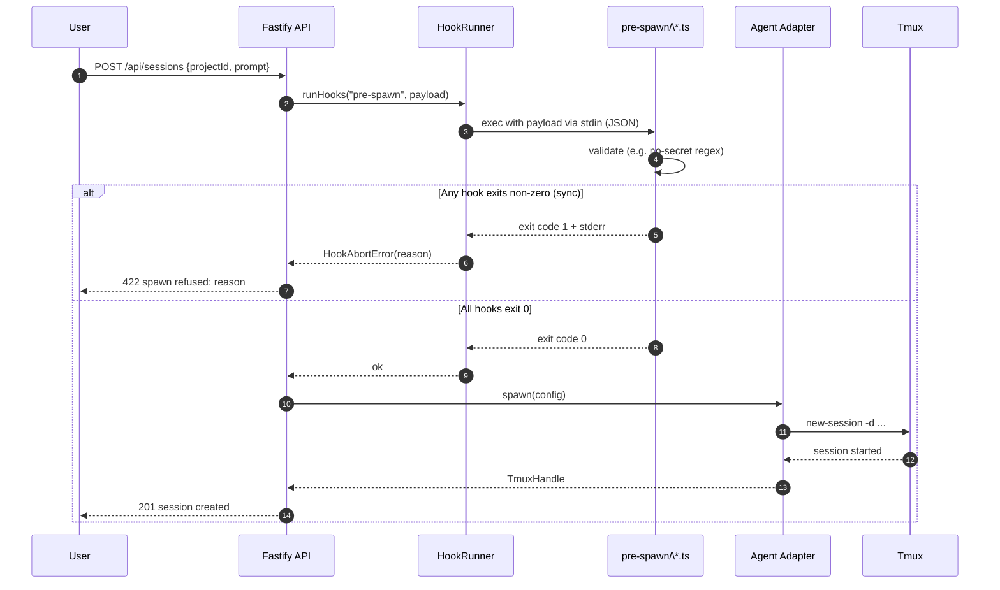
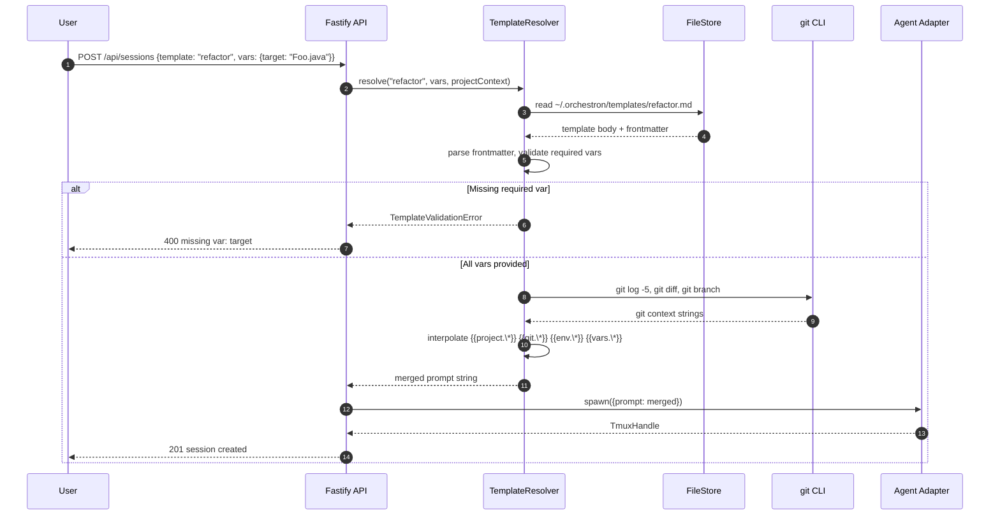
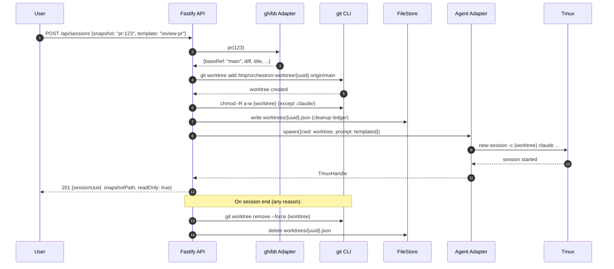
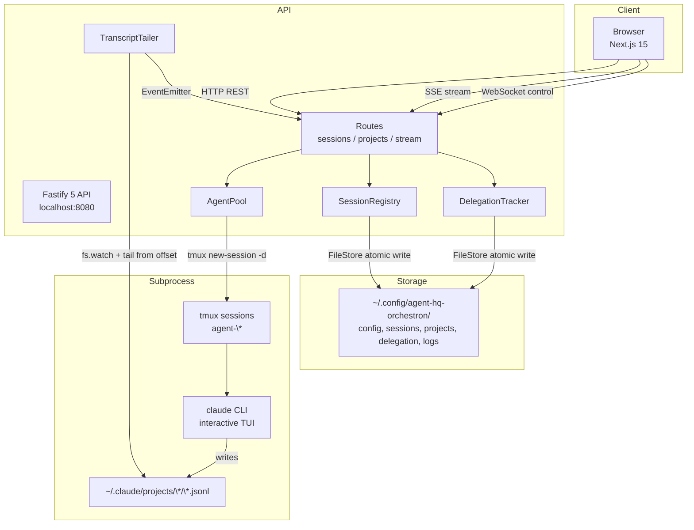
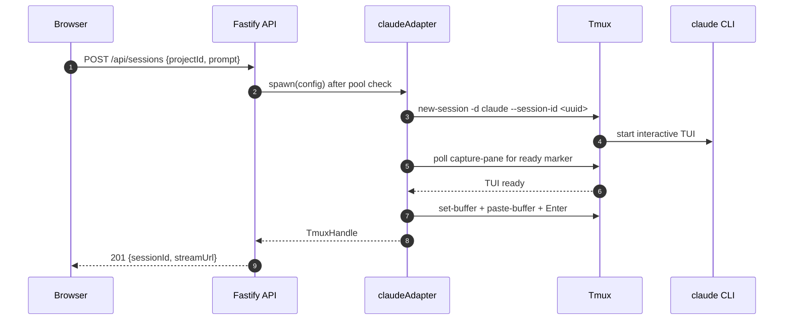
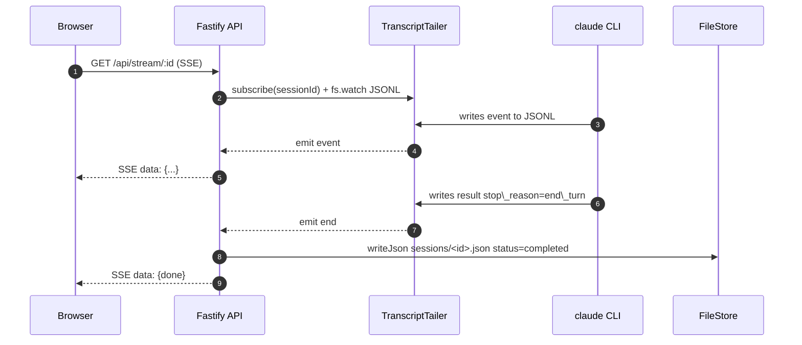
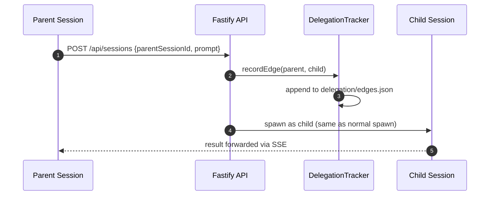
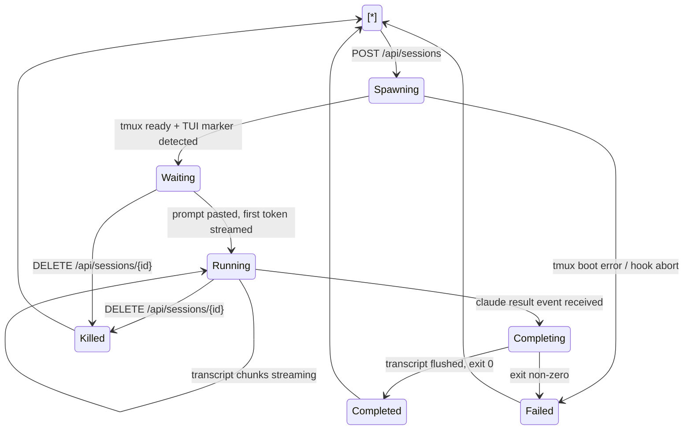

agent-hq-orchestron - High-Level Design
=======================================

| Attribute | Value |
| --- | --- |
| **Date** | 2026-08-15 |
| **Status** | Draft |
| **Version** | 1.0 |
| **Author** | Adi Novriansyah |
| **Reference** | Tycho ([firewalker06/tycho](https://github.com/firewalker06/tycho)), claude-cli-bridge (`~/Codes/claude-cli-bridge/`), nafu-bg-claude |

---

Table of Contents
-----------------

* [Overview](#overview)
* [Impacted Applications](#impacted-applications)
* [Requirements Overview](#requirements-overview)
* [Technical Implementation](#technical-implementation)
* [System Architecture](#system-architecture)
* [Data Flow & Privacy](#data-flow--privacy)
* [Security Considerations](#security-considerations)
* [Dependencies](#dependencies)
* [Scalability Strategy](#scalability-strategy)
* [Observability](#observability)
* [Testing Strategy](#testing-strategy)
* [Risk, Limitations & Out of Scope](#risk-limitations--out-of-scope)
* [Deployment Plan](#deployment-plan)
* [Open Items](#open-items)
* [Assumptions](#assumptions)
* [Rationale — Stack Choices](#rationale-stack-choices)
* [Revision History](#revision-history)

---

Overview
--------

`agent-hq-orchestron` adalah web-based supervisor untuk coding agents (Claude, Codex, OpenCode) — reimplementasi konsep [Tycho](https://github.com/firewalker06/tycho) ke stack TypeScript full-stack (Next.js 15 + Fastify 5) dengan penyimpanan file-based (JSON + JSONL). Berjalan lokal per-user, spawn CLI agent sebagai subprocess interaktif via tmux — menggunakan subscription quota (Claude Pro/Max), **bukan** `claude -p` API credit.

### Background

Tycho open-source (MIT, Ruby 3.2) menawarkan pola "Factorio for coding agents" — dashboard TUI untuk manage banyak agent session concurrent, dengan parent-child delegation dan file-based state. Tapi ada gap untuk use case Adi:

1. Stack Ruby tidak konsisten dengan preferensi TS Adi
2. UI hanya TUI — tidak ada visualisasi graph orkestrasi
3. Distribusi Homebrew-only, tidak native untuk workflow Linux
4. Tidak reuse pola OpenClaw yang sudah proven (`claude-cli-bridge`, `nafu-bg-claude`)

Fitur ini membangun equivalent web-based dengan pola pattern yang sudah proven di ekosistem OpenClaw, dan menutup gap visualisasi DAG orkestrasi.

### Goals

* Supervisor web UI untuk manage banyak Claude/Codex session concurrent (single user, localhost)
* Reuse tmux + interactive CLI subprocess pattern → subscription quota, bukan API credit
* File-based storage (JSON + JSONL append-only, atomic write + `.bak` backup) untuk zero-ops deployment
* Visualisasi DAG parent-child delegation via React Flow
* Extensible ke CLI lain (Codex, OpenCode, Aider) via adapter pattern

### Non-Goals

* Multi-user / auth / team dashboard (single-user desktop tool)
* Cloud deployment (fully local; remote access via Tailscale/ngrok user's own choice)
* Windows native support (macOS + Linux via tmux; Windows via WSL)
* `claude -p` / Anthropic SDK direct mode — **EXPLICITLY EXCLUDED** (consume API credit)
* PostgreSQL / Redis / message queue — SKIP dulu, cukup file-based

---

Impacted Applications
---------------------

| Application | Impact Type | Description |
| --- | --- | --- |
| `@agent-hq-orchestron/web` (Next.js 15) | **New** | Web UI: dashboard, session detail view, orchestration DAG, project registry |
| `@agent-hq-orchestron/api` (Fastify 5) | **New** | REST + SSE + WebSocket API, spawn `claude` subprocess via tmux, tail JSONL transcript |
| `@agent-hq-orchestron/shared` | **New** | Shared TypeScript types + Zod schemas antara FE ↔ BE |
| `@agent-hq-orchestron/file-store` | **New** | TS port dari Tycho `HQ::FileStore` — atomic write, `.bak` backup, JSONL append |
| `@agent-hq-orchestron/tui` (Ink 5) | **New** | Terminal dashboard — React-for-terminals, share Zod types dari `shared`, feature-parity partial dgn Web UI (dashboard, session detail, kill/spawn) |
| `@agent-hq-orchestron/cli` (Commander 12) | **New** | Full CLI subcommand tree — `serve`, `tui`, `token`, `qr`, `project`, `session`, `schedule`. Automation-friendly (scriptable, JSON output mode) |
| `~/Codes/claude-cli-bridge/` | Reference | Baca sebagai pattern reference (tidak dimodifikasi) |
| `~/.local/bin/nafu-bg-claude` | Reference | Pattern reference untuk tmux spawn + JSONL tail |
| `~/.claude/projects/<cwd>/*.jsonl` | Read-only consumed | Tail untuk streaming session transcript ke browser |

---

Requirements Overview
---------------------

### Functional Requirements

| ID | Requirement | Priority |
| --- | --- | --- |
| FR-01 | User dapat spawn Claude session dari web UI dengan initial prompt + agent config | Must Have |
| FR-02 | Setiap session di-track: status (active/waiting/completed/failed), tmux name, JSONL path, token usage, cost | Must Have |
| FR-03 | Real-time stream event JSONL dari `claude` ke browser via Server-Sent Events (SSE) | Must Have |
| FR-04 | User dapat lihat parent-child session (delegation) sebagai directed graph di React Flow, **dengan ownership semantics**: parent session boleh kill/inspect child, child inherit project scope + adapter config parent, kill parent = kill semua descendant recursive | Must Have |
| FR-05 | User dapat kill running session dari UI (`tmux kill-session`) | Must Have |
| FR-06 | Session history persist across restart — resume via `claude --resume <uuid>` | Must Have |
| FR-07 | User dapat register project (path folder) sebagai workspace untuk session | Must Have |
| FR-08 | Pool limit — max N concurrent subprocess (configurable, default 20), reject spawn kalau full | Should Have |
| FR-09 | PWA installable — Web UI expose `manifest.webmanifest` + service worker sehingga user bisa "Add to Home Screen" di iOS/Android untuk supervise session dari HP saat mobile | Should Have |
| FR-10 | QR-code onboarding — CLI subcommand `orchestron qr` render QR di terminal berisi URL Tailscale/LAN + Bearer token; scan dari HP auto-open Web UI dengan token pre-filled ke `sessionStorage` | Should Have |
| FR-11 | TUI dashboard — `orchestron tui` launch Ink-based terminal UI: list running session, tail live transcript, spawn/kill dari keyboard shortcut. Feature-parity partial dgn Web UI (no DAG graph, no project registry edit) | Should Have |
| FR-12 | Full CLI subcommand tree — `orchestron {serve,tui,token,qr,project,session,schedule}` dengan `--json` flag untuk machine-readable output. Setiap subcommand punya `--help` generated dari Zod schema | Should Have |
| FR-13 | Session search / filter UI (by project, status, date, tag) | Should Have |
| FR-14 | Support CLI adapter Codex, OpenCode, Aider via config-driven adapter | Nice to Have |
| FR-15 | Scheduled agent runs (cron-style, mirip Tycho `schedules/`) | Nice to Have |
| FR-16 | Hooks system — pre-spawn, post-transcript-chunk, on-session-end, on-error, on-schedule-fire. User dapat register hook script (Node.js/shell) di `~/.orchestron/hooks/*.{ts,sh}` yang dipanggil sync dengan event payload via stdin JSON. Non-zero exit dari pre-spawn = abort spawn | Should Have |
| FR-17 | Prompt templates — reusable prompt library di `~/.orchestron/templates/*.md` dengan variable interpolation (`{{project}}`, `{{branch}}`, `{{date}}`, `{{git.diff}}`, custom via hooks). Pilih via CLI (`orchestron session spawn --template refactor`) atau UI dropdown | Should Have |
| FR-18 | Usage metrics dashboard — per-project/per-adapter/per-model breakdown: token count (input/output/cache), cost (dari API response header), session duration, spawn count. Expose via `GET /api/metrics` + Web UI `/metrics` route (recharts) | Should Have |
| FR-19 | Response style customization — global `~/.orchestron/style.md` di-prepend ke setiap prompt (kalau ada), plus per-template style override | Nice to Have |
| FR-20 | Auto-update mechanism — `orchestron update` subcommand: check npm registry, prompt confirm, run `npm install -g @agent-hq-orchestron/cli@latest`, restart via systemd/pm2 kalau ada | Nice to Have |
| FR-21 | Project groups & tags — `projects.json` tambah `group` (single) + `tags` (array). UI filter/group by keduanya. Backward-compat: field opsional, default null | Nice to Have |
| FR-22 | Git host integration — pluggable adapter untuk `gh` (GitHub) & `bb` (Bitbucket). Resolve PR diff, PR metadata, issue body, review comments jadi variabel prompt template (`{{gh.pr.123.diff}}`, `{{bb.pr.456.reviewers}}`). Read-only, auth pakai user's own `gh auth` / `bb` config | Should Have |
| FR-23 | Agent-scoped snapshot — spawn session dgn cwd = temp git worktree yang di-checkout ke PR base ref (via `git worktree add`). Session baca-only ke snapshot; write attempt error ke UI. Cleanup worktree saat session end. Mirror pattern Tycho "agent-scoped snapshots" | Should Have |

### Non-Functional Requirements

| ID | Requirement | Target |
| --- | --- | --- |
| NFR-01 | Session spawn latency (tmux boot + TUI ready + first paste) | < 3s p95 |
| NFR-02 | JSONL event streaming latency (transcript write → browser paint) | < 200ms p95 |
| NFR-03 | Max concurrent subprocess | 20 (configurable) |
| NFR-04 | Storage durability | Atomic write + `.bak` recovery, no corruption on `kill -9` |
| NFR-05 | Portability | Copy `~/.config/agent-hq-orchestron/` = full backup + restore |
| NFR-06 | Dev bootstrap | `npm install && npm run dev` → running dalam < 60s |
| NFR-07 | Cost | Nol API credit consumed — verify via Anthropic dashboard |
| NFR-08 | Availability | Best-effort local; process supervisor via systemd user unit opsional |

---

Technical Implementation
------------------------

### Overview

Pendekatan: full-TypeScript monorepo (npm workspaces + Turborepo), dua aplikasi (`web` Next.js, `api` Fastify) + dua package internal (`shared` types, `file-store` atomic-write). Backend spawn `claude` CLI sebagai subprocess interaktif via `tmux new-session -d`, kemudian tail JSONL transcript (`~/.claude/projects/<cwd>/<uuid>.jsonl`) dari offset pre-spawn, emit event stream via SSE ke browser. Frontend render dashboard list, session detail dengan log stream, dan DAG parent-child pakai React Flow.

Pattern spawn identik dengan `claude-cli-bridge` dan `nafu-bg-claude` — sudah proven di production Adi. Yang berbeda: bridge Python di reference itu spawn on-demand + kill setelah selesai; di sini session dibiarkan hidup di tmux sampai user explicit kill atau `stop_reason=end_turn` terdeteksi.

### Key Components

#### Component 1: `@agent-hq-orchestron/web` (Next.js 15 Frontend)

* **Purpose:** Web UI untuk manage session, visualisasi DAG delegation, project registry
* **Technology:** Next.js 15 App Router, React 18, shadcn/ui, Tailwind CSS, `@xyflow/react` (React Flow), Zustand (client state), `@tanstack/react-query` (server state), native `EventSource` untuk SSE
* **Changes Required:** All new — pages: `/` (dashboard), `/session/[id]`, `/graph`, `/projects`, `/settings`

#### Component 2: `@agent-hq-orchestron/api` (Fastify Backend)

* **Purpose:** REST + streaming API, subprocess pool management, transcript tailing, delegation tracking
* **Technology:** Fastify 5, TypeScript, `@fastify/sensible`, `@fastify/websocket`, `pino` logger
* **Changes Required:** All new. Services:
  + `AgentPool` — Map<sessionId, AgentProcess>, enforce max concurrent, kill on-demand
  + `SessionRegistry` — CRUD session metadata via FileStore
  + `TranscriptTailer` — watch JSONL from offset, emit events via EventEmitter
  + `DelegationTracker` — parent-child edges (source-of-truth JSON, in-memory index)
  + Adapters: `claudeAdapter`, `codexAdapter` (Phase 3), `opencodeAdapter` (Phase 3)

#### Component 3: `@agent-hq-orchestron/file-store` (Storage Library)

* **Purpose:** Atomic file operations mirroring Tycho `HQ::FileStore` semantics
* **Technology:** Node.js `fs` + `write-file-atomic` + `proper-lockfile`
* **Changes Required:** All new. API:
  + `writeJson(path, value)` — tmp file → fsync → rename + fsync\_dir, backup `.bak`
  + `readJson(path, fallback)` — try main, fall back to `.bak` on JSON parse error
  + `appendJsonl(path, event)` — append-only line
  + `readJsonlFrom(path, offset)` — read from byte offset ke EOF
  + Vitest coverage untuk concurrent write safety

#### Component 4: `@agent-hq-orchestron/shared` (Types + Schemas)

* **Purpose:** Shared TypeScript interfaces + Zod validation schemas
* **Technology:** TypeScript, Zod
* **Changes Required:** All new. Contains: `SessionMetadata`, `AgentAdapter`, `SpawnConfig`, `SessionEvent`, `DelegationEdges`

### API Changes

#### New Endpoints

| Method | Endpoint | Description |
| --- | --- | --- |
| GET | `/api/health` | Liveness — check tmux + storage writable |
| POST | `/api/sessions` | Spawn new session |
| GET | `/api/sessions` | List sessions (filter: status, projectId, date range) |
| GET | `/api/sessions/:id` | Get session detail (metadata + latest events) |
| DELETE | `/api/sessions/:id` | Kill running session (`tmux kill-session`) |
| POST | `/api/sessions/:id/input` | Send follow-up prompt ke running session |
| GET | `/api/stream/:id` | **SSE** — stream JSONL events dari session's transcript |
| GET | `/api/graph` | Full delegation graph `{ nodes, edges }` |
| GET | `/api/projects` | List registered projects |
| POST | `/api/projects` | Register new project |
| WS | `/api/control/:id` | WebSocket — bidirectional control (kill, follow-up) |

#### Request/Response Examples

**POST /api/sessions**

Request:

```
{
  "projectId": "proj-abc123",
  "agentType": "claude",
  "model": "claude-sonnet-4-6",
  "initialPrompt": "Refactor the payment service tests",
  "parentSessionId": null
}
```

Response (201 Created):

```
{
  "id": "sess-xyz789",
  "projectId": "proj-abc123",
  "agentType": "claude",
  "status": "active",
  "parentSessionId": null,
  "claudeSessionUuid": "550e8400-e29b-41d4-a716-446655440000",
  "tmuxName": "agent-a1b2c3d4",
  "jsonlPath": "/home/adi/.claude/projects/-home-adi-Works-x/550e8400-....jsonl",
  "startedAt": "2026-08-15T10:30:00Z",
  "streamUrl": "/api/stream/sess-xyz789"
}
```

**GET /api/stream/:id** (Server-Sent Events)

```
data: {"type":"assistant","content":"I'll start by reading the test file..."}

data: {"type":"tool_use","name":"Read","input":{"file_path":"tests/payment.test.ts"}}

data: {"type":"tool_result","output":"..."}

data: {"type":"result","stop_reason":"end_turn","tokens":{"input":1234,"output":567}}
```

### Storage Layout (File-Based)

Storage root: `~/.config/agent-hq-orchestron/`

```
~/.config/agent-hq-orchestron/
├── config/
│   ├── hq.yml                        # Projects, agent templates, defaults (YAML)
│   └── hq.yml.bak
├── sessions/
│   ├── <session-uuid>.json           # Session metadata
│   ├── <session-uuid>.json.bak
│   └── <session-uuid>.jsonl          # Append-only event log (mirror of Claude JSONL)
├── projects/
│   ├── <project-uuid>.json
│   └── <project-uuid>.json.bak
├── delegation/
│   └── edges.json                    # Parent-child adjacency list
└── logs/
    └── api-YYYY-MM-DD.log            # API server log
```

**No SQL database.** Semua state adalah file. Query pattern:

* List sessions = scan `sessions/*.json` (acceptable sd ~10K session; migrate ke SQLite Phase 2 kalau perlu)
* Filter by status = scan + JSON parse (bisa cached di memory)
* Full-text search = grep atau in-memory index (Phase 3)

**Data model TypeScript:**

```
interface SessionMetadata {
  id: string
  projectId: string
  agentType: 'claude' | 'codex' | 'opencode'
  status: 'active' | 'waiting' | 'completed' | 'failed'
  parentSessionId: string | null
  claudeSessionUuid: string
  tmuxName: string
  jsonlPath: string
  initialPrompt: string
  finalResponse: string | null
  tokenUsage: { input: number; output: number } | null
  costUsd: number | null
  startedAt: string
  endedAt: string | null
  metadata: Record<string, unknown>
}

interface DelegationEdges {
  version: 1
  edges: Array<{ parent: string; child: string; createdAt: string }>
}
```

### CLI Adapter Contract

Kritikal — **HANYA interactive TUI mode via tmux**, tidak boleh `claude -p`:

```
export interface AgentAdapter {
  name: string
  spawn(config: SpawnConfig): Promise<TmuxHandle>
  resume(sessionUuid: string, config: ResumeConfig): Promise<TmuxHandle>
  sendPrompt(handle: TmuxHandle, prompt: string): Promise<void>
  waitTuiReady(handle: TmuxHandle, timeoutMs: number): Promise<void>
  kill(handle: TmuxHandle): Promise<void>
}

// apps/api/src/adapters/claude.ts
export const claudeAdapter: AgentAdapter = {
  name: 'claude',
  async spawn(config) {
    const tmuxName = `agent-${randomId(8)}`
    const claudeUuid = crypto.randomUUID()

    // JANGAN pake -p / --print. Interactive TUI only.
    await execFile('tmux', [
      'new-session', '-d', '-s', tmuxName,
      '-x', '220', '-y', '50',
      '-c', config.workspace,
      'env', `CLAUDE_CONFIG_DIR=${config.configDir}`,
      'claude',
      '--model', config.model,
      '--permission-mode', 'bypassPermissions',
      '--session-id', claudeUuid,
    ])

    return { tmuxName, claudeUuid, jsonlPath: resolveJsonlPath(config, claudeUuid) }
  },
  // sendPrompt: tmux set-buffer + paste-buffer + Enter
  // waitTuiReady: poll capture-pane sampai detect ❯ / │ > / ? for shortcuts
  // kill: tmux kill-session -t <name>
}
```

**Enforcement:** Adapter contract test verify argv **tidak pernah** mengandung `-p` atau `--print`. Runtime assertion sebelum spawn.

### Multi-Adapter Registry

Mirror pattern Tycho (`lib/hq/harness_registry.rb`) tapi lebih extensible — Tycho only supports Claude-compatible custom adapter; orchestron support arbitrary adapter via full `AgentAdapter` interface.

#### Built-in adapters (Phase 1)

| Adapter | Binary | Session flag | Config env var | Transcript source |
| --- | --- | --- | --- | --- |
| `claude` | `claude` | `--session-id <uuid>` / `--resume <uuid>` | `CLAUDE_CONFIG_DIR` (default `~/.claude`) | `$CLAUDE_CONFIG_DIR/projects/<cwd-slug>/<uuid>.jsonl` |
| `codex` | `codex` | `--session <id>` | `CODEX_HOME` (default `~/.codex`) | `$CODEX_HOME/sessions/<id>.jsonl` |
| `opencode` | `opencode` | `--session-id <id>` | `OPENCODE_CONFIG_DIR` | `$OPENCODE_CONFIG_DIR/logs/<id>.jsonl` |

**Pi omitted** di Phase 1 karena Anthropic Pi belum stable public CLI.

#### Custom adapter interface

```
// packages/shared/src/adapter.ts
export interface AgentAdapter {
  name: string;                            // "claude" | "codex" | user-defined
  binary: string;                          // resolvable via PATH
  buildSpawnArgv(config: SpawnConfig): {
    argv: string[];
    env: Record<string, string>;         // merged over process.env at spawn
    readyMarker: RegExp;                   // tmux capture-pane match untuk detect siap
  };
  resolveTranscriptPath(config: SpawnConfig, sessionId: string): string;
  parseTranscriptChunk(line: string): TranscriptEvent | null;  // adapter-specific JSONL schema
}

// Registration
registry.register(claudeAdapter);          // built-in
registry.register(codexAdapter);
registry.register(myCustomAdapter);        // via ~/.orchestron/adapters/*.ts (loaded at boot)
```

#### Per-project override (termasuk `CLAUDE_CONFIG_DIR`)

Setiap project di `~/.orchestron/projects/<name>.json` punya `agentConfig` field yang override default:

```
{
  "name": "nanovest-backend",
  "path": "/home/adi/Works/nanovest-backend",
  "agentConfig": {
    "adapter": "claude",
    "model": "claude-opus-4-7",
    "env": {
      "CLAUDE_CONFIG_DIR": "/home/adi/ClaudeConfigs/adi.novriansyah",
      "ANTHROPIC_MODEL": "claude-opus-4-7"
    },
    "extraArgs": ["--permission-mode", "bypassPermissions"]
  }
}
```

**Precedence saat spawn:** `agentConfig.env` > adapter default env > `process.env`. Contoh use case: Adi punya multiple Claude config dir (per-persona: `adi.novriansyah`, `scriberion`, dst) — pilih per-project tanpa export env global.

#### CLI untuk manage adapter

* `orchestron adapter list` — tampil built-in + custom adapter yang ter-load
* `orchestron project add --agent claude --config-dir ~/ClaudeConfigs/persona-X`
* `orchestron project edit <name> --env CLAUDE_CONFIG_DIR=/lain/path`

### Delegation Ownership Semantics

Perluasan FR-04: DAG bukan cuma visualisasi — punya authorization model.

* **Parent-child link tersimpan di `~/.orchestron/delegation/<parent-uuid>.jsonl`** — append-only. Row schema: `{childUuid, spawnedAt, prompt, adapterConfig}`.
* **Kill cascade:** `DELETE /api/sessions/<parent-uuid>` recursively kill semua descendant. Confirmation modal di UI menampilkan tree depth.
* **Config inheritance:** child spawn inherit `projectId` + `adapterConfig` parent, kecuali di-override eksplisit di spawn call. Prevent orphan session dengan config berbeda.
* **Read scope:** parent bisa read transcript child (untuk aggregate summary). Sibling tidak bisa read sibling — enforce di API layer via `getAncestorChain()` check.
* **Detached mode:** user boleh flag session sebagai `detached: true` saat spawn → tidak muncul di delegation tree parent, tidak kena kill cascade. Use case: user manual spawn dari CLI dalam context session parent yang sedang jalan.

### Hooks System (FR-16)

Extension point untuk custom automation. Mirror pattern Tycho `docs/HOOKS.md` tapi Node.js-native.

**Hook Invocation Flow (pre-spawn abort path)**



**Step-by-step:**

1. User POST spawn request via browser/CLI.
2. API defer ke `HookRunner`, pass payload `{projectId, adapter, model, prompt, workspaceDir}`.
3. HookRunner scan `~/.orchestron/hooks/pre-spawn/*` lexicographic, exec masing-masing dgn payload JSON via stdin.
4. Hook parse stdin, run validation logic (contoh: cek prompt tidak mengandung `sk-ant-`, `ghp_`).
5. Kalau hook exit non-zero → HookRunner throw `HookAbortError`, spawn di-abort, user dapat 422 dgn alasan.
6. Kalau semua hook exit 0 → adapter di-invoke, tmux new-session, session record ditulis, response 201.

#### Hook events & contract

| Event | Timing | Payload (stdin JSON) | Sync/Async | Non-zero exit effect |
| --- | --- | --- | --- | --- |
| `pre-spawn` | Sebelum `tmux new-session` | `{projectId, adapter, model, prompt, workspaceDir}` | Sync | **Abort spawn**, log error ke session record |
| `post-transcript-chunk` | Setiap JSONL line di-parse | `{sessionUuid, event: TranscriptEvent}` | Async fire-and-forget | Log error only, tidak block streaming |
| `on-session-end` | Session status → completed/failed/killed | `{sessionUuid, exitReason, tokenUsage, durationMs}` | Async | Log error only |
| `on-error` | Adapter throw / claude crash | `{sessionUuid, error: {message, stack}, tmuxName}` | Async | Log error only |
| `on-schedule-fire` | Scheduled run trigger (FR-15) | `{scheduleId, cronExpr, plannedProjectId}` | Sync | **Skip schedule fire** that iteration |

#### Discovery & execution

```
// ~/.orchestron/hooks/pre-spawn/enforce-no-secrets.ts
import { readFile } from 'node:fs/promises';
const payload = JSON.parse(await readFile(0, 'utf8'));  // stdin
const banned = ['sk-ant-', 'sk-', 'ghp_', 'AKIA'];
if (banned.some(p => payload.prompt.includes(p))) {
  console.error(`refusing spawn: prompt contains secret-like token`);
  process.exit(1);
}
```

* **File layout:** `~/.orchestron/hooks/<event-name>/*.{ts,mjs,sh}`. Semua file di dir event akan di-execute lexicographic order.
* **Runtime:** `.ts`/`.mjs` di-run via `node --experimental-strip-types`; `.sh` via `bash`. Timeout default 5s (configurable per-hook via shebang comment).
* **Sandbox:** hook run dgn env yang sama dgn orchestron server, plus `ORCHESTRON_HOOK_EVENT`. Trust boundary sama dgn OS user — bukan sandbox, user own the hook.

### Prompt Templates (FR-17)

Reusable prompt library. Simpel: markdown file + Mustache-style variables.

**Template Resolution Flow**



**Step-by-step:**

1. User request spawn dgn template name + variable map.
2. API delegate ke `TemplateResolver` dgn context (template name, user vars, project).
3. Resolver load template markdown dari FileStore.
4. Resolver parse YAML frontmatter, validate required variables — kalau miss, 400.
5. Resolver exec git CLI di project workspace untuk resolve `{{git.branch}}`, `{{git.log-5}}`, `{{git.diff}}`.
6. Resolver interpolate semua namespace (`project.*`, `git.*`, `env.*`, `vars.*`) via Mustache-style substitution.
7. Merged prompt string passed ke adapter untuk spawn — sisanya identik dgn flow spawn regular.

```
<!-- ~/.orchestron/templates/refactor.md -->
---
name: refactor
description: Standard refactor prompt with git context
variables:
  target: { type: string, required: true, prompt: "File/module to refactor?" }
---
Refactor `{{target}}` in `{{project.name}}` (branch: `{{git.branch}}`).

Recent commits:
{{git.log-5}}

Current diff:
```diff
{{git.diff}}
```

Follow the project's style guide. Small diffs preferred.
```

#### Variable resolvers

| Variable | Source |
| --- | --- |
| `{{project.name}}`, `{{project.path}}` | Project registry |
| `{{git.branch}}`, `{{git.log-N}}`, `{{git.diff}}`, `{{git.status}}` | `execFile('git', [...], { cwd: project.path })` |
| `{{date}}`, `{{date.iso}}` | `new Date()` |
| `{{user}}` | `os.userInfo()` |
| `{{env.FOO}}` | `process.env.FOO` |
| Custom | `pre-spawn` hook stdout JSON merged ke context |

#### Invocation

```
orchestron session spawn \
  --project nanovest-backend \
  --template refactor \
  --var target=CryptoBuyService.java

# Web UI: dropdown template + form field per required variable
```

### Git Host Integration (FR-22 + FR-23)

Pluggable adapter untuk fetch PR/issue context dari remote git host, plus safe read-only snapshot via worktree.

#### Adapter interface

```
// packages/shared/src/git-host.ts
export interface GitHostAdapter {
  name: 'gh' | 'bb' | string;
  detect(projectPath: string): Promise<boolean>;  // git remote parse
  pr(id: string | number): Promise<{
    number: number;
    title: string;
    body: string;
    author: string;
    baseRef: string;
    headRef: string;
    diff: string;               // unified diff, capped at 500KB
    reviewers: string[];
    comments: Array<{author, body, path?, line?}>;
    status: 'open' | 'merged' | 'closed';
  }>;
  issue(id: string | number): Promise<{number, title, body, labels, assignees, comments}>;
}

// Built-in
export const ghAdapter: GitHostAdapter    // wraps `gh pr view --json ...`
export const bbAdapter: GitHostAdapter    // wraps Bitbucket REST via `bb` CLI or curl
```

#### Detection & routing

* Saat project di-register, orchestron parse `git remote get-url origin` di project path.
* `github.com`/`*.github.com` → route ke `ghAdapter`.
* `bitbucket.org`/`*.bitbucket.org` → route ke `bbAdapter`.
* Selfhosted (GHE, Bitbucket Server) → user set `agentConfig.gitHost = 'gh'` eksplisit + env `GH_HOST`.

#### Prompt template variables (extends FR-17)

| Variable | Resolves to |
| --- | --- |
| `{{gh.pr.N.diff}}` / `{{bb.pr.N.diff}}` | Unified diff string |
| `{{gh.pr.N.title}}`, `.body`, `.author`, `.reviewers` | Meta fields (comma-separated array) |
| `{{gh.pr.N.comments}}` | Formatted markdown thread |
| `{{gh.issue.N.body}}` | Issue body markdown |
| `{{gh.pr.current}}` | PR yang match branch saat ini (kalau ada) — via `gh pr view` tanpa arg |

#### Agent-scoped snapshot (FR-23)

Untuk task "review PR" yang tidak boleh accidentally write ke branch aktif, spawn dgn `--snapshot pr:123`:

**Snapshot Spawn Flow**



**Step-by-step:**

1. User request review-PR session dgn `snapshot: pr:123`.
2. API resolve PR metadata via git host adapter (`gh` untuk GitHub, `bb` untuk Bitbucket).
3. API run `git worktree add` ke temp path, checkout `baseRef`. Objects shared dgn main repo (~50 MB overhead vs full clone).
4. API chmod worktree jadi read-only, kecuali `.claude/` untuk transcript write.
5. API write cleanup ledger ke `worktrees/{uuid}.json` — boot-time scanner cleanup orphan kalau crash.
6. Adapter spawn tmux dgn cwd = worktree path.
7. Response include `readOnly: true` flag — UI render banner "Session in snapshot mode".
8. Saat session end (kill/complete/fail), API **selalu** jalankan `git worktree remove --force` + hapus cleanup ledger.

```
orchestron session spawn \
  --project nanovest-backend \
  --template review-pr \
  --snapshot pr:123 \
  --var pr=123

# Behind the scenes:
# 1. git worktree add /tmp/orchestron-worktree/<uuid> origin/pr-base
# 2. cwd = worktree path
# 3. chmod -R read-only pada worktree (except .claude/ untuk transcript)
# 4. tmux new-session -c <worktree-path> ...
# 5. on session end: git worktree remove --force <path>
```

* **Write attempt handling:** claude subprocess yang coba write ke read-only worktree akan hit `EACCES`. Adapter catch dari transcript tool\_use error, surface warning ke UI: *"Session is in read-only snapshot mode. Suggestion: apply changes via `orchestron session apply` setelah review."*
* **Cleanup guarantee:** `on-session-end` internal hook selalu run `git worktree remove --force`. Kalau server crash mid-session, boot orchestron akan scan `~/.orchestron/worktrees/*.json` dan cleanup orphan.
* **Disk cost:** git worktree share objects folder → cheap (linked, bukan full clone). ~50 MB per snapshot untuk repo 500 MB source.

#### Auth & scope

* **Auth = user's own.** `gh auth login` di server user account; `bb` config di `~/.bb/config`. Orchestron tidak store token sendiri.
* **Read-only via config default.** Tidak expose `gh pr merge` atau destructive command dari prompt template — hanya read endpoint. Enforcement: whitelist argv di adapter wrapper.
* **Rate limit awareness.** Cache PR diff 5 menit di `~/.orchestron/cache/gh/`; invalidate saat template invocation eksplisit `--refresh`.

#### Bitbucket-specific notes (Adi workflow)

* Adi mostly kerja di Bitbucket (Nanovest, NanoFutures) → `bb` adapter Priority-1 untuk implementasi. GitHub `gh` tetap Phase 1 karena orchestron sendiri di GitHub (dogfood).
* `bb` CLI: pakai `~/Codes/bb-cli` kalau ada; fallback ke `curl https://api.bitbucket.org/2.0/...` dgn `BITBUCKET_APP_PASSWORD` env.

### Observability & Metrics (FR-18)

File-based metrics store, di-aggregate on-demand — bukan time-series DB (overkill untuk single-user tool).

#### Data source

* **Per session:** di `on-session-end` hook internal, tulis `{sessionUuid, projectId, adapter, model, tokens: {input, output, cache_read, cache_creation}, cost, durationMs, endedAt}` ke `~/.orchestron/metrics/sessions.jsonl` (append-only).
* **Token source:** parse dari JSONL transcript `result` line (Claude CLI emit token count di final event).
* **Cost source:** di-derive dari token × pricing table (hardcoded per model, updateable via `orchestron pricing refresh`).

#### Query API

```
GET /api/metrics?groupBy=project&from=2026-08-01&to=2026-09-01
→ {
  "buckets": [
    {"key": "nanovest-backend", "sessions": 47, "tokens": 12_400_000, "cost_usd": 21.47, "avg_duration_ms": 380_000},
    {"key": "nafutech-workspace", "sessions": 23, "tokens": 8_100_000, "cost_usd": 14.02, ...}
  ],
  "total": {"sessions": 70, "tokens": 20_500_000, "cost_usd": 35.49}
}
```

#### UI

* Route `/metrics` di Web UI: `recharts` line chart (daily cost) + bar chart (per-project) + table breakdown.
* TUI: `orchestron tui` tab "Metrics" — sparkline + summary numbers via Ink.
* CLI: `orchestron metrics --group-by project --json` — pipe-friendly untuk custom dashboard.

#### Non-features (explicit)

* ❌ Real-time metrics (Prometheus scrape) — overkill.
* ❌ Long-term retention rollup (daily → weekly → monthly). File cukup 1 tahun untuk single-user; rotate manually.
* ❌ Anomaly detection / alerts — external tool (Grafana + file scrape) kalau butuh.

### PWA & Mobile Onboarding

Adopsi dari Tycho: Web UI sekaligus jadi installable Progressive Web App, dengan QR-code onboarding untuk zero-friction pairing HP ↔ desktop.

#### PWA manifest (FR-09)

* Next.js expose `app/manifest.ts` → generate `manifest.webmanifest` berisi `name`, `short_name`, `start_url`, `display: "standalone"`, `theme_color`, dan icon set 192/512/512-maskable (di-embed di `packages/web/public/icons/`).
* Service worker minimal (`app/sw.ts` via `@serwist/next` atau bare `next-pwa`) — cache shell assets (`/`, `/session/[id]`, static CSS/JS), **tidak cache** API/SSE/WS. Strategy: `NetworkFirst` untuk shell, biar update HLD FE tetap fresh.
* iOS quirks: tambah `apple-touch-icon` + `apple-mobile-web-app-capable` di `<head>` — iOS Safari gak fully honor Web App Manifest.

#### QR onboarding flow (FR-10)

User run `orchestron qr` di terminal → CLI:

1. Baca `ORCHESTRON_REMOTE_TOKEN` dari env (atau `~/.orchestron/config.json`).
2. Resolve bind address: kalau `tailscale ip -4` exit 0 → pakai Tailscale IP; else pakai LAN IP dari `os.networkInterfaces()` (filter non-loopback, prefer `192.168.*`/`10.*`).
3. Bangun URL: `https://<host>:<port>/pair?token=<token>`
4. Render QR di terminal via `qrcode-terminal` (small=false untuk high-contrast di light-theme terminal).
5. User scan dari HP → buka Web UI di browser mobile → route `/pair` baca `?token=`, simpan ke `sessionStorage`, redirect ke dashboard. Setelah itu install prompt PWA nongol.

**Security note:** QR di-render sekali per session terminal, tidak di-store. Token yang embedded = full-access — hindari screen-share saat generate. CLI print warning: `WARNING: this QR contains a full-access token. Do not share your screen.`

```
// apps/cli/src/commands/qr.ts (contract)
export async function qrCommand(opts: { port: number }): Promise<void> {
  const token = requireToken();  // exits with clear error if unset
  const host = await resolveExposableHost();  // tailscale → LAN → error
  const url = `https://${host}:${opts.port}/pair?token=${token}`;
  console.log(warnBanner);
  qrTerminal.generate(url, { small: false });
  console.log(`\nURL: ${url}\n`);
}
```

---

System Architecture
-------------------

### Architecture Diagram



**Architecture Explanation:**

1. **Client (Browser):** Next.js 15 App Router. Dashboard grid, session detail dengan live log stream, DAG orchestration graph pakai React Flow.
2. **API (Fastify):** Single Node process, port 8080. Routes handle CRUD + SSE. Services orchestrate subprocess pool, storage, dan transcript tailing.
3. **Storage (File-Based):** Semua state di `~/.config/agent-hq-orchestron/`. Atomic write + `.bak` backup. No SQL DB.
4. **Subprocess (tmux + claude):** Setiap session = 1 detached tmux session menjalankan `claude` interaktif. TranscriptTailer watch JSONL yang di-write Claude ke `~/.claude/projects/`.

### Sequence Diagram - Session Spawn (Phase A: Boot + Prompt)



**Step Explanation (Phase A):**

1. Browser POST spawn request dengan project + prompt awal
2. Fastify check pool capacity (max concurrent 20), delegate ke `claudeAdapter.spawn`
3. Adapter jalankan `tmux new-session -d ... claude --model X --session-id <uuid>` (**interactive, bukan `-p`**)
4. Claude CLI start di detached tmux, render TUI
5. Adapter poll `tmux capture-pane` untuk deteksi prompt marker
6. TUI ready terdeteksi
7. Adapter paste prompt via `tmux set-buffer + paste-buffer` lalu `send-keys Enter`
8. Adapter return TmuxHandle ke Fastify
9. API return `201` dengan session detail + `streamUrl`

### Sequence Diagram - Session Spawn (Phase B: Stream + Complete)



**Step Explanation (Phase B):**

1. Browser subscribe SSE endpoint `/api/stream/:id`
2. Fastify register subscription di TranscriptTailer, mulai `fs.watch` pada JSONL path Claude
3. Claude write event ke JSONL (assistant, tool\_use, tool\_result)
4. Tailer detect + emit event ke Fastify
5. Fastify push SSE `data: {...}` ke Browser
6. Claude write result dengan `stop_reason=end_turn`
7. Tailer detect end + emit
8. Fastify update session metadata status ke `completed` via FileStore atomic write
9. Fastify push SSE `done` marker + close stream; kill tmux session

### Sequence Diagram - Parent-Child Delegation



**Step Explanation:**

1. Parent session POST spawn request dengan `parentSessionId` field
2. Fastify record edge di `DelegationTracker`
3. Tracker atomic-append edge ke `delegation/edges.json`
4. Fastify spawn child session (flow sama seperti sequence A + B di atas)
5. Child result di-forward ke parent's SSE stream — parent bisa lihat sub-session progress. Graph endpoint aggregate edges + node metadata untuk React Flow rendering.

### State Diagram - Session Lifecycle



**State transitions:**

1. **Spawning** → tmux new-session running, waiting for TUI marker (❯ / │ > / ? for shortcuts). Timeout 3s.
2. **Waiting** → TUI ready, prompt belum di-paste (rare intermediate — biasanya langsung ke Running).
3. **Running** → prompt di-paste, claude streaming token. Self-loop untuk setiap JSONL chunk yang di-emit.
4. **Completing** → claude emit `result` event (final token count, cost). API menunggu transcript flush + tmux exit.
5. **Completed / Failed / Killed** → terminal states. Record persist di `sessions/{uuid}.json`, transcript archive-eligible.

---

Data Flow & Privacy
-------------------

### Data Classification

| Data | Classification | Location | Handling |
| --- | --- | --- | --- |
| Session prompts | User content | `~/.config/agent-hq-orchestron/sessions/*.jsonl` | File permission 0o600, no upload |
| Session responses | User content + code | `~/.claude/projects/*/*.jsonl` (Claude's dir) + our sessions/\*.jsonl | 0o600 |
| Claude session UUID | Internal ID | Session metadata JSON | 0o600 |
| Anthropic API key | Sensitive | Not stored — Claude CLI manages own auth | N/A |
| Project paths | User workspace | `projects/*.json` | 0o600 |

**All data local-only.** No external service. No telemetry. No cloud upload.

### File Permission

Semua file yang di-write oleh FileStore pakai mode `0o600` (owner read/write only). Directory `~/.config/agent-hq-orchestron/` pakai mode `0o700`. Sesuai pattern Tycho.

### File-Store Schema (ER Diagram)

File-based store dimodelkan sebagai entity relationship — meskipun bukan RDBMS, hubungan antar entity tetap eksplisit dan enforce di service layer.

```mermaid
erDiagram
PROJECT ||--o{ SESSION : "hosts"
PROJECT ||--o{ TEMPLATE\_BINDING : "may use"
SESSION ||--o| SESSION\_PARENT : "may have"
SESSION ||--o| SNAPSHOT : "may run in"
SESSION ||--|| METRICS\_RECORD : "produces"
SESSION ||--o{ TRANSCRIPT\_LINE : "emits"
TEMPLATE ||--o{ TEMPLATE\_BINDING : "referenced by"
HOOK\_DEFINITION ||--o{ HOOK\_INVOCATION : "triggers"
SESSION ||--o{ HOOK\_INVOCATION : "context"
PROJECT {
string id PK
string name
string path
string group
stringArray tags
json agentConfig
date createdAt
}
SESSION {
string uuid PK
string projectId FK
string adapter
string model
string status
string tmuxName
string jsonlPath
int tokenInput
int tokenOutput
float costUsd
date startedAt
date endedAt
boolean detached
}
SESSION\_PARENT {
string childUuid PK
string parentUuid FK
date spawnedAt
string spawnPrompt
}
SNAPSHOT {
string sessionUuid PK
string prSource
string baseRef
string worktreePath
boolean readOnly
}
TEMPLATE {
string name PK
string description
json frontmatter
string bodyPath
}
TEMPLATE\_BINDING {
string projectId FK
string templateName FK
json defaultVars
}
HOOK\_DEFINITION {
string event PK
string scriptPath PK
int timeoutMs
}
HOOK\_INVOCATION {
string id PK
string event
string sessionUuid FK
int exitCode
string stderr
date firedAt
}
METRICS\_RECORD {
string sessionUuid PK
string projectId FK
string adapter
string model
int tokens
float costUsd
int durationMs
date endedAt
}
TRANSCRIPT\_LINE {
string sessionUuid FK
int offset
string eventType
json payload
date at
}
```

**Entity mapping ke file-store:**

| Entity | File path | Cardinality |
| --- | --- | --- |
| `PROJECT` | `~/.orchestron/projects/<id>.json` | ~10-50 |
| `SESSION` | `~/.orchestron/sessions/<uuid>.json` | ~1K-10K (rotation policy) |
| `SESSION_PARENT` | `~/.orchestron/delegation/<parent>.jsonl` (append-only) | 1 row per child |
| `SNAPSHOT` | `~/.orchestron/worktrees/<uuid>.json` (cleanup ledger) | 0-N per session |
| `TEMPLATE` | `~/.orchestron/templates/<name>.md` | ~10-30 |
| `TEMPLATE_BINDING` | Embedded di `PROJECT.agentConfig.templates` | — |
| `HOOK_DEFINITION` | `~/.orchestron/hooks/<event>/<script>` (discovery via dir scan) | ~5-20 |
| `HOOK_INVOCATION` | `~/.orchestron/logs/hooks-YYYY-MM-DD.jsonl` (append-only) | N per session |
| `METRICS_RECORD` | `~/.orchestron/metrics/sessions.jsonl` (append-only) | 1 per completed session |
| `TRANSCRIPT_LINE` | `~/.claude/projects/<cwd>/<uuid>.jsonl` (Claude native) | N per session |

**Sample data (SESSION row):**

```
{
  "uuid": "01j8x2p3-...",
  "projectId": "proj_nanovest_be",
  "adapter": "claude",
  "model": "claude-opus-4-7",
  "status": "completed",
  "tmuxName": "agent-a7b3c1d2",
  "jsonlPath": "/home/adi/ClaudeConfigs/adi.novriansyah/projects/nanovest-backend/01j8x2p3.jsonl",
  "tokenInput": 4200, "tokenOutput": 1850,
  "costUsd": 0.083,
  "startedAt": "2026-09-03T07:22:14Z",
  "endedAt": "2026-09-03T07:28:41Z",
  "detached": false
}
```

---

Security Considerations
-----------------------

Consolidated security posture — konsisten dgn positioning "local-first single-user desktop tool", bukan multi-tenant service. Detail teknis auth di [Rationale — Stack Choices](#rationale-stack-choices); detail file permission di [Data Flow & Privacy](#data-flow--privacy).

### Threat Model

| Trust boundary | Threat | Mitigasi |
| --- | --- | --- |
| OS user isolation | Sibling user di same host access `~/.orchestron/` | File mode `0o600`, dir mode `0o700`. Fastify bind default `127.0.0.1` |
| Loopback ↔ non-loopback | User accidentally expose ke LAN/Tailscale tanpa auth | **Boot guard**: bind non-loopback + `ORCHESTRON_REMOTE_TOKEN` unset → refuse to start (fail-fast) |
| Bearer token in transit | Token leaked via HTTP request log / query string | HTTPS mandatory di remote mode (Tailscale HTTPS auto-cert). WS/SSE query param logged only saat DEBUG level |
| Timing attack on token compare | Attacker infer token via response time diff | `crypto.timingSafeEqual` untuk semua Bearer compare |
| Prompt injection via transcript | Malicious content di JSONL render Markdown → XSS di Web UI | Next.js sanitize markdown via `rehype-sanitize`. CSP strict: `default-src 'self'; script-src 'self' 'wasm-unsafe-eval'` |
| Secret leakage via prompt | User accidentally paste API key ke prompt → tersimpan di JSONL selamanya | Optional built-in `pre-spawn` hook `enforce-no-secrets.ts` — regex banned prefix (`sk-ant-`, `ghp_`, `AKIA`). Enabled by default, disable via `orchestron config set hooks.pre-spawn.enforce-no-secrets false` |
| Custom hook / adapter code execution | User install malicious hook script yang punya full-file-system access | **Not mitigated** — hook runs sebagai OS user. Documented sebagai user responsibility (sama seperti VS Code extension trust model) |
| Git worktree escape | Session di snapshot mode escape read-only via symlink | Worktree buat di `/tmp/orchestron-worktree/` yang OS user own. Symlink escape masih terbatas ke file yang user bisa read anyway. Not a defense boundary — safety net, not security boundary |

### Auth & Authz Summary

* **Authentication:** opt-in Bearer token via `ORCHESTRON_REMOTE_TOKEN`. Zero-friction loopback mode (no auth), enforced remote mode.
* **Authorization:** single-tier — kalau punya token, akses semua endpoint. Tidak ada RBAC (violate Non-Goals multi-user).
* **Session identity:** tidak ada per-request user attribution. Log tercatat sebagai "authenticated / anonymous" only.
* Detail teknis + state machine table: [Rationale > Auth Model](#rationale-stack-choices).

### Security Controls Matrix

| Control | Where enforced | Type |
| --- | --- | --- |
| File permission `0o600`/`0o700` | FileStore write path | Preventive |
| Bind loopback default | Fastify boot config | Preventive |
| Boot guard non-loopback + no-token | Startup validator | Preventive |
| Bearer `preHandler` hook | Fastify global middleware | Preventive |
| WS/SSE token via `preValidation` | Upgrade handler | Preventive |
| Markdown sanitize + CSP | Next.js render pipeline | Preventive |
| Secret regex hook | Built-in pre-spawn hook | Preventive (opt-out) |
| Argv assertion (no `-p`) | Adapter contract test + runtime | Preventive |
| Cleanup ledger orphan scan | Boot-time scanner | Corrective |
| Hook exec logging | `~/.orchestron/logs/hooks-*.jsonl` | Detective |

### OWASP Top 10 Checklist

| OWASP | Status | Reasoning |
| --- | --- | --- |
| A01 Broken Access Control | ✅ Addressed | Single-tier Bearer, single-user model. No IDOR risk |
| A02 Cryptographic Failures | ✅ Addressed | Token via `crypto.randomBytes`, compare via `timingSafeEqual`. HTTPS mandatory remote |
| A03 Injection | ⚠️ Partial | Zod validate all inputs. Prompt injection ke claude adalah design intent (user IS the prompt author), bukan attack |
| A04 Insecure Design | ✅ Addressed | Threat model explicit, boot guard fail-fast |
| A05 Security Misconfiguration | ✅ Addressed | `orchestron doctor` checks: bind address, token presence, file mode |
| A06 Vulnerable Components | ⚠️ User responsibility | `npm audit` di CI. Auto-update (FR-20) untuk push patch |
| A07 Identity/Auth Failures | N/A | Tidak ada user identity system (single-user) |
| A08 Software/Data Integrity | ✅ Addressed | Atomic file write + `.bak` recovery. npm registry SHA verification via package-lock |
| A09 Logging/Monitoring | ⚠️ Basic | File-based log rotation. No SIEM integration (out of scope) |
| A10 SSRF | N/A | Orchestron tidak fetch arbitrary URL user-supplied. Git host adapter argv whitelisted |

### Secrets Management

* **`ORCHESTRON_REMOTE_TOKEN`** — env var, generated via `orchestron token`. Not stored di file-store (user manage via env / `~/.orchestron/config.json` mode 0o600).
* **Anthropic API key** — **not managed by orchestron**. Claude CLI handle sendiri via `~/.claude/`. Kita hanya set `CLAUDE_CONFIG_DIR` untuk pilih persona.
* **GitHub / Bitbucket token** — user's own `gh auth` / `bb` config. Orchestron tidak persist.
* **No SM/Vault integration** — out of scope for single-user tool. Kalau user butuh, mereka set env dari password manager sebelum start server.

Dependencies
------------

External binaries, npm packages, dan services yang wajib present di host. Semua di-detect saat `orchestron doctor` (subcommand baru untuk pre-flight check).

### Runtime dependencies (host binaries)

| Dependency | Purpose | Version | Fallback |
| --- | --- | --- | --- |
| `node` | Runtime BE + FE | ≥ 20 LTS | N/A (mandatory) |
| `npm` | Install + auto-update (FR-20) | ≥ 10 | pnpm/yarn opsional |
| `tmux` | Detached subprocess for claude CLI | ≥ 3.2 | N/A (design assumption) |
| `claude` | Coding agent CLI (Anthropic official) | Latest | Auth via user's `~/.claude/` |
| `codex` | Codex adapter (FR-14) | Latest | Adapter disabled kalau binary absent |
| `opencode` | OpenCode adapter (FR-14) | Latest | Adapter disabled kalau binary absent |
| `git` | Template resolver + snapshot worktree (FR-17, FR-23) | ≥ 2.40 (worktree) | Template git.\* vars null kalau absent |
| `gh` | GitHub adapter (FR-22) | ≥ 2.40 | Adapter disabled untuk GitHub repo |
| `bb` (or curl+token) | Bitbucket adapter (FR-22) | N/A | Curl-based fallback via `BITBUCKET_APP_PASSWORD` |
| `tailscale` | Remote access address resolver (FR-10) | Latest | QR command fall back ke LAN IP dari `os.networkInterfaces()` |

### npm package dependencies (production)

| Package | Purpose | Alternative dipertimbangkan |
| --- | --- | --- |
| `fastify` ^5 | API server | Express (rejected — see Rationale) |
| `@fastify/websocket` | WebSocket support | ws (lower level) |
| `fastify-type-provider-zod` | Zod ↔ JSON Schema bridge | fastify-plugin-zod (fork) |
| `next` ^15 | Web UI + PWA | Vite+React (no SSR) |
| `reactflow` | DAG delegation viz (FR-04) | d3-dag |
| `ink` ^5 | TUI (FR-11) | Blessed (rejected — see Rationale) |
| `commander` ^12 | CLI (FR-12) | oclif (rejected) |
| `qrcode-terminal` | QR onboarding (FR-10) | qrcode (browser-only) |
| `@serwist/next` | PWA service worker (FR-09) | next-pwa |
| `recharts` | Metrics chart (FR-18) | Chart.js |
| `zod` | Shared validation | ArkType, Valibot |
| `picocolors`, `cli-table3` | CLI output formatting | chalk (heavier) |

### External service dependencies

| Service | Purpose | SLA assumption | Fallback |
| --- | --- | --- | --- |
| Anthropic API | Called by claude CLI (bukan orchestron langsung) | Best-effort (subscription tier) | Session marks failed, retry manual |
| GitHub / Bitbucket API | PR/issue metadata (FR-22) | 99.9% | Cache 5min, staleness banner di UI |
| Tailscale coordination server | NAT traversal untuk remote access (FR-10) | 99.99% | Fallback LAN IP direct |
| npm registry | Auto-update (FR-20) | 99.9% | Manual update via git pull |

Scalability Strategy
--------------------

Orchestron adalah single-node single-user tool — scaling bukan "horizontal cluster" tapi "how many concurrent session muat di 1 host" dan "kapan degrade". Detail deployment target: [Deployment Plan > Deployment Scenarios](#deployment-plan).

### Scaling Approach per Component

| Component | Bottleneck | Scale strategy |
| --- | --- | --- |
| Fastify API | CPU untuk SSE/WS fan-out | Single process, event-loop. Node cluster mode **ditolak** — file-store race condition tanpa lock coordinator |
| Next.js Web UI | SSR render latency | Static prerender untuk shell (`/`, `/session`), client-render untuk session detail. PWA cache shell offline |
| Claude subprocess pool | RAM (~300-500 MB/subprocess) | Configurable `maxConcurrent` (NFR-03 default 20). Auto-adjust default berdasar `os.totalmem() / 800 MB` saat pertama boot |
| tmux socket | Session count | Single socket handle 100+ sessions. Not a bottleneck di skala tool ini |
| File-store (JSON) | Directory scan untuk list (~10K entries) | In-memory index cached, invalidate on write. Migrate ke SQLite kalau >10K session (Phase 2) |
| JSONL transcript | Disk IOPS untuk tail | Node `fs.watch` + offset persist. Single tailer per session, batch flush setiap 50ms ke SSE clients |
| Metrics rollup | Scan sessions.jsonl | Append-only file, aggregate on-demand. Kalau >1M entries, add daily rollup file di Phase 2 |

### Capacity Planning Projections

| Host profile | Concurrent sessions | JSONL storage (1 tahun @ avg 5 MB/session) | Notes |
| --- | --- | --- | --- |
| Laptop 16 GB / 4 core / 500 GB SSD | 10-15 | ~50-75 GB (~10-15K sessions/tahun) | Retention policy kritikal setelah tahun 1 |
| Server 8 GB / 4 vCPU / 58 GB (Adi current) | 5-8 | ~15-25 GB (limited by disk) | Wajib retention 30-hari + archive gzip. Storage bottleneck sebelum RAM |
| Workstation 64 GB / 16 core | 50+ | Disk-limited | tmux + Fastify handle fine; bottleneck jadi API rate limit di Anthropic side |

### Bottleneck Analysis

| Order | Bottleneck | Symptom | Threshold | Action |
| --- | --- | --- | --- | --- |
| 1 | **RAM** (subprocess pool) | OOM kill, spawn queue overflow | < 500 MB available | Reduce `maxConcurrent`, atau upgrade host |
| 2 | **Anthropic rate limit** | 429 di claude CLI, session status=failed | Subscription tier quota | Backoff + retry di CLI, orchestron surface warning di UI |
| 3 | **Disk** (JSONL append) | Slow transcript write, EIO | > 90% disk full | Retention policy jalankan, alert user |
| 4 | **File-store scan** (list sessions) | API `GET /api/sessions` > 1s | > 10K entries | Migrate ke SQLite (Phase 2) |
| 5 | **SSE fan-out** | Multiple browser tabs slow update | > 20 concurrent SSE conns per session | Rare — single-user tool, tidak diprioritaskan |

### Non-Scale (explicit)

* ❌ **Horizontal Fastify cluster** — file-store race condition, lock coordinator complexity > benefit.
* ❌ **Sharded storage** — single-user, single-tenant. No multi-tenant partition need.
* ❌ **Load balancer / reverse proxy tier** — direct client → Fastify sufficient.
* ❌ **Distributed cache** — in-process Map cukup untuk in-memory index.

Observability
-------------

Local-first, file-based. Bukan Grafana/Prometheus stack. Detail metrics design: [Technical Implementation > Observability & Metrics (FR-18)](#technical-implementation). Section ini formalize logging + tracing yang **bukan** metrics.

### Logging Strategy

| Layer | Sink | Format | Retention |
| --- | --- | --- | --- |
| Fastify API | `~/.orchestron/logs/api-YYYY-MM-DD.log` | Pino JSON per line | 30 hari (rotate daily) |
| Hook execution | `~/.orchestron/logs/hooks-YYYY-MM-DD.jsonl` | JSONL `{event, script, exitCode, stderr, at}` | 30 hari |
| Adapter spawn | API log dgn `component: adapter` | Pino JSON | 30 hari |
| Claude transcript | `~/.claude/projects/<cwd>/<uuid>.jsonl` (Claude native) | JSONL Claude schema | User-managed (out of orchestron scope) |
| Web UI errors | Browser console + optional `POST /api/errors` beacon | JSON | 7 hari |
| TUI errors | stderr → tmux capture-pane → user visible | Plain text | Ephemeral (session-scoped) |

### Log Level Convention

* **ERROR:** Spawn fail, hook abort, file corruption, adapter throw.
* **WARN:** Malformed JSONL line, cache stale, retry attempt.
* **INFO:** Session lifecycle transitions (spawn, complete, kill), hook fire result.
* **DEBUG:** Full request/response, WS/SSE token value (only saat env `LOG_LEVEL=debug`).

### Tracing

* **Correlation ID:** setiap request generate `traceId` (16-char hex), propagate ke semua log line dalam request scope via Node `AsyncLocalStorage`.
* **Session-scoped trace:** semua event yang related ke `sessionUuid` tercatat dgn `sessionUuid` field. User bisa `jq 'select(.sessionUuid=="...")' logs/api-*.log` untuk timeline reconstruction.
* **No distributed tracing (OTel/Jaeger)** — single-node, tidak butuh cross-service span propagation.

### Key Metrics (production monitoring)

| Metric | Source | SLO / Alert threshold |
| --- | --- | --- |
| Session spawn success rate | `sessions.jsonl` | > 95% (weekly window) |
| Session spawn latency p95 | API log timing | < 3s (NFR-01) |
| Transcript stream latency p95 | API log timing | < 200ms (NFR-02) |
| Subprocess pool utilization | Runtime stat endpoint | Warn > 80% |
| Disk usage `~/.orchestron/` | `orchestron doctor` periodic | Alert > 90% |
| Hook failure rate per event | `hooks-*.jsonl` | Warn > 10% dalam 24 jam |

### Runtime Introspection Endpoints

| Endpoint | Purpose | Auth |
| --- | --- | --- |
| `GET /api/health` | Liveness — uptime, node version | Public (whitelisted) |
| `GET /api/readiness` | Readiness — config loaded, data dir writable, >=1 adapter registered. `200 {status:'ready',uptime,checks}` / `503 {status:'not_ready',...}`. Deliberately does **not** gate on tmux: a headless-only instance is ready without it | Public |
| `GET /api/stats` | Runtime — active session count, pool utilization, disk free | Bearer required |
| `GET /api/metrics` | Aggregate rollup (FR-18) | Bearer required |

Testing Strategy
----------------

### Test Pyramid

| Layer | Coverage | Tool | Kritis? |
| --- | --- | --- | --- |
| Unit | FileStore atomic write, adapter argv assertion, DAG builder, Zod schema, state machine transitions, boot guard logic | Vitest | Yes |
| E2E | Full flow: register project → spawn (real tmux + mock claude fixture) → stream → kill → assert lifecycle. Mencakup path yang biasanya Integration test cover | Playwright + mock claude shim | Yes |
| Contract | Zod validation FE↔BE, adapter interface conformance | Zod + Vitest | Yes |

**Integration layer di-skip.** Rationale: single-user tool dgn scope terbatas, cost integration test (real-tmux fixture per suite + slow feedback loop) > benefit vs coverage yang bisa dicapai via Unit + E2E. E2E suite pakai mock claude CLI shim (deterministic JSONL) untuk cover behavior yang biasanya Integration test verify — tanpa maintain layer test terpisah.

### Kritikal Test Cases

1. **FileStore concurrent write** — 2 process write ke path yang sama, assert atomic rename tidak corrupt data
2. **Adapter argv assertion** — verify tidak pernah ada `-p` / `--print` di argv spawn
3. **Tailer offset persistence** — restart API mid-session, resume dari offset lama, assert no duplicate emit
4. **Tmux crash recovery** — SIGKILL tmux session → status auto-transition ke `failed`
5. **JSONL malformed line** — tailer tetap continue, log warning, skip line
6. **Hook abort semantics (FR-16)** — pre-spawn hook exit 1 → spawn aborted, session record punya `status: failed` + `failureReason: hook-aborted`. Verify tmux session tidak pernah start.
7. **Hook timeout (FR-16)** — hook sleep > 5s (default) → HookRunner kill process, treat sebagai abort untuk sync events, log-only untuk async.
8. **Prompt template missing var (FR-17)** — template require `{{target}}`, spawn tanpa `--var target=...` → 400 validation error before hooks run.
9. **Template git resolver error (FR-17)** — project bukan git repo → `{{git.*}}` vars resolve ke empty string, tidak throw.
10. **Bearer token boot guard (Auth Model)** — bind ke `0.0.0.0` tanpa `ORCHESTRON_REMOTE_TOKEN` → server refuse to start, exit code 1, stderr message jelas.
11. **Bearer token timing-safe compare** — wrong token differ 1 byte vs differ 100 bytes → verify response time identik (guard against timing attack).
12. **Snapshot cleanup guarantee (FR-23)** — kill orchestron server saat session snapshot masih running. Restart server → boot scanner detect orphan worktree via `~/.orchestron/worktrees/*.json`, cleanup, log recovery.
13. **Snapshot read-only enforcement (FR-23)** — session di snapshot mode coba write file di worktree → assert claude subprocess dapat `EACCES`, transcript catch tool\_use error, UI banner appear.
14. **Git host adapter fallback (FR-22)** — `gh` binary absent, template invoke `{{gh.pr.123.diff}}` → resolver return empty string + warning log (bukan hard error).
15. **Kill cascade correctness (FR-04)** — spawn parent → 2 children → 1 grandchild. Kill parent → verify all descendants tmux killed, semua status=killed, no orphan.
16. **Federation peer offline (Option 2)** — peer instance unreachable → laptop UI show peer tab dgn banner "peer offline, last seen 2m ago", tidak crash entire UI.
17. **PWA service worker cache staleness (FR-09)** — deploy new FE version → cached shell tetap load, API/SSE fresh. Verify no offline-locked-in stale UI.
18. **Metrics rollup accuracy (FR-18)** — 10 sessions dgn known token count → `/api/metrics?groupBy=project` return exact sum, no double-count kalau session di-resume.

### Test data & fixtures

* **Mock claude CLI:** shell script yang emit deterministic JSONL sequence (init → messages → result). Digunakan di unit + integration untuk avoid API call real.
* **Mock gh/bb response:** JSON fixture di `test/fixtures/gh/`. Test adapter dgn `--dry-run` flag.
* **Ephemeral tmux socket:** setiap test suite pakai `tmux -L test-{pid}` untuk isolation.

---

Risk, Limitations & Out of Scope
--------------------------------

### Out of Scope (Current Design)

| Item | Reason | Future Consideration |
| --- | --- | --- |
| Multi-user / auth | Single-user local desktop tool | Phase 4 (if converted to team product) |
| Cloud deployment | Fully local; agents butuh filesystem access | User can use Tailscale for remote access |
| Windows native | Depends on tmux | WSL supported; native via `node-pty` in Phase 3 |
| `claude -p` mode | Consume API credit (Adi's cost constraint) | Never planned |
| Postgres/Redis | Overkill for single-user | Phase 2 migration path to SQLite documented |
| Anthropic SDK direct | Same as `-p` — API credit | Never planned |
| Encrypted storage | Local-only; user's own machine security | User can encrypt `~/.config/` via LUKS/FileVault |

### Design Limitations

| Limitation | Impact | Workaround | Future Improvement |
| --- | --- | --- | --- |
| File-based storage tidak scale ke > 10K session | List/filter slow (full scan) | Cap history retention di config, atau archive | Migrate ke SQLite (better-sqlite3 + Drizzle) di Phase 2 |
| Single-machine only | No distributed session | User run instance per machine | Out of scope |
| No live collaboration | State per user | N/A | Out of scope |
| Windows native tidak didukung | Windows user pakai WSL | WSL2 supported | Node-pty adapter Phase 3 |
| Tmux dependency | Butuh tmux ≥ 3.0 di system | README prerequisites clear | Alternative node-pty adapter |
| Session state kalau OS restart | Semua tmux session hilang | Manual `--resume` untuk continue | systemd user service opsional untuk auto-restore |

### Known Risks

| ID | Risk | Probability | Impact | Mitigation | Status |
| --- | --- | --- | --- | --- | --- |
| R-01 | Tmux TUI ready detection race condition | Medium | Session spawn timeout | Poll capture-pane dengan regex `❯` / `│ >`, retry paste sd 3x (proven pattern bridge.py) | Open |
| R-02 | Claude JSONL schema berubah upstream | Low | Tailer parse error | Zod validation dengan fallback ke raw text; version pin di README | Open |
| R-03 | Concurrent write ke `edges.json` (2 subprocess selesai bareng) | Medium | File corrupt | Atomic write + `proper-lockfile` advisory lock | Open |
| R-04 | Filesystem full → JSONL append gagal | Low | Session data lost | Pre-check disk space, log warning, dispatch alert | Open |
| R-05 | `claude` CLI upgrade break `--session-id` semantic | Medium | Resume broken | Pin CLI version di README + regression test suite | Open |
| R-06 | Accidental `claude -p` di adapter → tagihan API credit | Low | Cost incident | Adapter contract test: argv assertion; runtime pre-spawn assertion | Open |
| R-07 | Session hijack — user attach ke tmux + type manual | Low | State corrupt | Mark session failed; document expected behavior | Open |
| R-08 | Web UI exposed ke network tanpa auth | Medium | Unauthorized spawn | Bind default ke `127.0.0.1` only; require explicit `--host 0.0.0.0` flag + warning | Open |

---

Deployment Plan
---------------

### Prerequisites

* Node.js ≥ 20 (LTS) — check via `.nvmrc`
* npm ≥ 10
* tmux ≥ 3.0
* `claude` CLI installed + authenticated dengan Adi's Claude Pro/Max subscription
* `~/.claude/` dan `~/.config/agent-hq-orchestron/` writable
* OS: macOS atau Linux (Windows via WSL only)

### Deployment Phases

| Phase | Description | Rollback Point |
| --- | --- | --- |
| **0. Bootstrap** (Day 1, ~2 jam) | Scaffold monorepo, packages, hello world FE+BE, health endpoint, smoke test | Yes — `git reset --hard <initial>` |
| **1. MVP CLI Bridge** (Week 1) | `claudeAdapter`, `AgentPool`, `SessionRegistry`, `TranscriptTailer`, SSE endpoint, basic dashboard | Yes — git tag `v0.1` |
| **2. DAG + Delegation** (Week 2) | `DelegationTracker`, React Flow graph page, `--resume` support | Yes — git tag `v0.2` |
| **3. Polish + Extensibility** (Week 3) | Codex + OpenCode adapters, session search UI, scheduled runs (cron), README + install script | Yes — git tag `v0.3` |
| **4. Public Release** (opsional) | Push ke public GitHub Adi, kredit Tycho, dokumentasi user | N/A |

### Feature Flags

Tidak pakai runtime feature flag — semua config via `~/.config/agent-hq-orchestron/config/hq.yml`. Reload on file change (chokidar).

| Config Key | Description | Default |
| --- | --- | --- |
| `pool.maxConcurrent` | Max concurrent CLI subprocess | `20` |
| `api.host` | Bind address | `127.0.0.1` (localhost only) |
| `api.port` | Fastify port | `8080` |
| `web.port` | Next.js port | `3000` |
| `retention.sessionsMaxCount` | Cap total sessions before archive | `10000` |
| `adapters.enabled` | Enabled adapter list | `['claude']` |

### Local Distribution

* `npm install && npm run build` → build FE + BE
* `npm run start` → run production build (localhost:3000 + localhost:8080)
* `scripts/init.sh` → bootstrap `~/.config/agent-hq-orchestron/{sessions,projects,delegation,logs}`
* Optional: systemd user unit template untuk auto-start
* Optional (Phase 4): Electron shell untuk desktop app packaging

### Rollback

Personal tool — rollback = `git checkout <prev-tag>` + `npm install`. Data di `~/.config/agent-hq-orchestron/` backward-compatible (atomic JSON, additive schema evolution).

### Deployment Scenarios

Analisis fit-per-target berdasarkan design constraint (single-user file-store + tmux + Claude subscription tied to OS user).

#### Scenario A: Laptop personal (baseline)

* **Target:** workstation Adi sehari-hari, akses cukup `localhost`.
* **Auth:** tidak set `ORCHESTRON_REMOTE_TOKEN`. Zero-friction.
* **Capacity:** tergantung laptop; asumsi 16 GB RAM → ~10-15 concurrent claude session.
* **Trade-off:** mati kalau laptop tidur / offline. Tidak bisa disupervise dari HP saat mobile.

#### Scenario B: Home server pribadi (Adi's server)

* **Target:** VM 4 vCPU / 7.8 GB RAM / 58 GB disk (spec server saat ini).
* **Auth:** `ORCHESTRON_REMOTE_TOKEN` set, expose via Tailscale. Bind ke Tailscale IP, bukan `0.0.0.0`.
* **Capacity realistis:** ~8-12 concurrent claude session (setiap subprocess ~300-500 MB) setelah cleanup process idle (kill vite dashboard understand-anything + 5 idle claude tmux session) menghasilkan 5.4 GB available RAM. Reserve ~1.4 GB untuk gateway + orchestron server + safety margin → ~4 GB untuk subprocess pool.
* **Storage:** JSONL transcript ~1-10 MB per session, 24 GB free = ratusan session. **Retention policy wajib**: archive session > 30 hari ke gzip di `~/.orchestron/archive/`.
* **Persistence:** `systemd --user` unit untuk auto-restart. State di `~/.orchestron/` survive reboot.
* **Backup:** rsync `~/.orchestron/` ke laptop nightly (fallback kalau server crash).
* **Risk:** single point of failure. Tailscale dependency untuk akses eksternal. Update cadence lebih lambat dari laptop (server jarang di-reboot).

#### Scenario C: Hybrid (laptop + server, state sync)

* **Target:** jalankan orchestron di dua tempat sekaligus, tapi hanya satu yang "active writer" pada satu waktu.
* **Mechanism:** shared `~/.orchestron/` via Syncthing atau rsync + file-lock (`flock` di `state.json`).
* **Risk:** file-lock lintas host tricky. **Not recommended untuk v1.**

#### Scenario D: Team dashboard (multi-user shared server)

* **Verdict: OUT OF SCOPE.** Melanggar Non-Goals eksplisit. Butuh:
  + Per-user OS account + setuid subprocess (Claude auth tied ke `$HOME/.claude/`).
  + Multi-tenant file-store namespacing.
  + Real auth layer (bukan single Bearer token).
  + Per-user tmux socket isolation.
* **Effort:** essentially different product. Rekomendasi: fork sebagai `orchestron-teams` project terpisah kalau demand muncul.

#### Capacity ceiling ringkas

| Metrik | Scenario A (laptop 16 GB) | Scenario B (server 8 GB) |
| --- | --- | --- |
| Concurrent claude session | ~10-15 | ~8-12 (post cleanup process idle) |
| JSONL storage capacity | SSD dependent | ~24 GB → ratusan session dengan retention 30 hari |
| CPU bottleneck | Never (IO-bound) | Never (load avg <1 saat 6 session) |
| Network bottleneck | N/A (localhost) | Tailscale ~50-100 ms latency, bandwidth >100 Mbps |

### Multi-Instance Topology

Setelah pilih deployment scenario, muncul pertanyaan: kalau orchestron jalan di laptop *dan* server, apakah state bisa di-sync? Jawaban singkat: **subprocess tidak bisa migrate lintas host**. Section ini kupas 3 topology yang viable + 1 anti-pattern yang ditolak.

#### Layer-by-layer sync feasibility

| Layer | Bisa sync? | Kenapa |
| --- | --- | --- |
| Running subprocess (claude PID + tmux session) | **Tidak** | Terikat ke host kernel + tmux socket. Laptop mati = session di laptop mati; tidak "pindah" ke server |
| JSONL transcript (finished session) | ✅ Ya (append-only) | File immutable setelah session done. Rsync/Syncthing one-way safe |
| Metadata state (projects, active session list) | ⚠️ Risky | JSON file, race condition kalau dua sisi nulis bersamaan. Butuh file-lock lintas host atau CRDT |

#### Option 1 (v1 default): Single-Host

* Pilih **salah satu** host (laptop OR server), jangan dua-duanya.
* Simple, zero-sync overhead, zero race condition.
* Rekomendasi: **server** untuk workflow yang butuh 24/7 uptime + mobile access; **laptop** untuk offline-first / airplane-mode use.
* Trade-off: kehilangan flexibility switch device.

#### Option 2 (v2 optional): Federation Read-Only View

Bukan "merge state", tapi laptop UI bisa *view* session yang running di server via cross-instance REST query.

```
// ~/.orchestron/peers.json (laptop side)
{
  "peers": {
    "home-server": {
      "url": "https://server.adi.ts.net:3001",
      "token": "<server's ORCHESTRON_REMOTE_TOKEN>",
      "label": "Home Server"
    }
  }
}
```

* **UI:** tab bar "Local" + "Home Server (peer)". Setiap tab render session list yang punya instance-nya sendiri.
* **Spawn:** user pilih target di UI ("Spawn on: Local / Home Server"). Request routed ke instance yang di-pilih.
* **Kill / send prompt:** HTTP call ke instance yang punya session. Bukan proxy transparent — user sadar target.
* **Federated view:** read-only. Peer state di-cache 30s dgn stale-while-revalidate.
* **Effort:** moderate — tambah `PeerRegistry` + `PeerClient` di API, tab UI di web.

#### Option 3 (v1 alternative): Server-Only + Thin Client

* Laptop **tidak jalanin** orchestron sama sekali — cuma browser + PWA connect ke server.
* Zero state di laptop → zero sync problem.
* Trade-off: laptop tergantung server + Tailscale up. Server down = zero fallback local. Airplane mode = mati.
* Fit untuk user yang selalu online + trust reliability server.

#### Anti-pattern: Bi-Directional Sync (ditolak)

Sempat dipertimbangkan pattern `~/.orchestron/` di-sync via Syncthing dua arah antar laptop ↔ server. **Ditolak** karena:

* **Race condition tidak solvable tanpa CRDT.** Kedua sisi bisa nulis `projects.json` bersamaan → conflict merge yang perlu manual resolve.
* **File-lock lintas host tidak reliable.** `flock` POSIX gak bekerja lintas Syncthing sync.
* **"Dual-source-of-truth" anti-pattern.** Melanggar prinsip file-based storage yang simplicity-oriented.
* **Over-engineered untuk single-user tool.** CRDT (Automerge/Yjs) work but adds massive complexity untuk problem yang bisa dihindari dgn pilih single-host.

#### Rekomendasi

| Use case | Topology |
| --- | --- |
| Solo developer, satu device utama | Option 1 — Single-host di laptop atau server |
| Butuh mobile visibility saat lagi keluar | Option 3 — Server-only + PWA (v1 ready) |
| Perlu spawn session di laptop (offline) + supervise dari HP di jalan | Option 2 — Federation view (v2, tunggu implementasi) |
| "Mau semua device work-in-parallel di project sama" | Wrong tool — pakai `tmux -CC` / VS Code Live Share / cloud IDE |

---

Open Items
----------

| ID | Item | Owner | Due Date | Status |
| --- | --- | --- | --- | --- |
| OI-01 | Konfirmasi package manager: **npm** (bukan pnpm) — sudah confirmed Adi | Adi | 2026-08-15 | Resolved |
| OI-02 | Data folder location: `~/.config/agent-hq-orchestron/` — sudah confirmed Adi (XDG) | Adi | 2026-08-15 | Resolved |
| OI-03 | Repo name: `agent-hq-orchestron` — sudah confirmed Adi | Adi | 2026-08-15 | Resolved |
| OI-04 | Push ke public GitHub — plan future, credit Tycho di README | Adi | TBD | Open |
| OI-05 | Codex CLI juga pakai `--session-id` pattern? Perlu spike sebelum Phase 3 | Adi | Phase 3 | Open |
| OI-06 | Scheduled runs: implement pakai in-Node cron (`node-cron`) atau delegate ke systemd user timer? | Adi | Phase 3 | Open |
| OI-07 | Fork Tycho Ruby vs full rewrite — decided: **rewrite** (TS full-stack preference) | Adi | 2026-08-15 | Resolved |
| OI-08 | Windows support scope: WSL only (Phase 1-3) atau native via node-pty di Phase 3? | Adi | Phase 3 | Open |
| OI-09 | Encrypted transcript at rest: opt-in via config? Atau delegate ke OS-level (LUKS/FileVault)? | Adi | Post-MVP | Open |

---

Assumptions
-----------

| ID | Assumption | Impact if Invalid |
| --- | --- | --- |
| A-01 | Adi's Claude Pro/Max subscription tetap valid | `claude` CLI tidak bisa auth → seluruh sistem non-functional |
| A-02 | tmux ≥ 3.0 tersedia di macOS/Linux dev env | Adapter tidak bisa spawn; butuh fallback ke node-pty (Phase 3 scope) |
| A-03 | `~/.claude/projects/<mangled-cwd>/*.jsonl` format stable di future Claude CLI versions | Tailer parse break; butuh update Zod schema + regression test |
| A-04 | Adi sanggup maintain single-person side project (no team review) | Development velocity slower; scope creep |
| A-05 | Node.js 20 LTS available di dev env | Butuh version bump `.nvmrc` |
| A-06 | File-based storage acceptable performance sd 1000 session | Migration ke SQLite lebih awal dari Phase 2 plan |
| A-07 | React Flow (`@xyflow/react`) MIT license OK untuk public GitHub release | Butuh alternative library (Cytoscape.js, sigma.js) |

---

Rationale — Stack Choices
-------------------------

HLD versi awal cuma stated stack tanpa reasoning. Section ini isi gap tersebut untuk keputusan yang paling sering ditanya.

### Backend: Fastify 5

Framework backend dipilih Fastify (bukan Express, NestJS, atau Hono) dengan pertimbangan berikut:

| Dimensi | Fastify 5 | Alternatif ditolak |
| --- | --- | --- |
| Streaming (SSE + WebSocket) | Native via `@fastify/websocket` + SSE lewat `reply.raw`; first-class untuk long-lived connection | Express: nested-router harus di-glue manual. Hono: SSE OK tapi Node adapter untuk WS belum se-mature |
| Type safety end-to-end | `fastify-type-provider-zod` auto-infer handler params dari Zod schema di package `shared` | Express: gak ada. NestJS: pakai `class-validator`, gak reuse Zod |
| Plugin architecture | Scoped encapsulation cocok untuk modular design (routes registry, JSONL tailer, tmux adapter sebagai plugin) | Express: middleware flat. NestJS: DI container overkill untuk 1 REST + 1 SSE + 1 WS |
| Boot time | < 50ms — critical untuk local dev tool yang sering di-restart | NestJS: 300ms+ karena decorator scan + DI wiring |
| Scope fit | Sweet spot: lebih ringan dari Nest, lebih type-safe & streaming-native dari Express | Hono: edge-oriented (Cloudflare Workers/Deno), Node runtime bukan target utama |

### TUI Framework: Ink 5

TUI dashboard dipilih **Ink** (React-for-terminals) dengan pertimbangan:

| Dimensi | Ink 5 | Alternatif ditolak |
| --- | --- | --- |
| Mental model & reuse | React component API — sama dgn `apps/web`. Sub-komponen (SessionRow, TranscriptPane) bisa share type + validation dari `packages/shared` | Blessed: imperative widget tree + callback-based, mental model beda |
| Ecosystem | Dipakai di production: GitHub Copilot CLI, Prisma Studio, Cloudflare Wrangler, Shopify CLI — mature, active maintenance | Blessed: last release 2020, unmaintained. Bubble Tea (Go): reintroduce Go toolchain dependency |
| Rendering model | Yoga layout engine (flexbox) — sama seperti web CSS, familiar | Blessed: box model manual (top/left/width absolute), painful untuk layout dinamis |
| Testing | `ink-testing-library` mirip `@testing-library/react`, snapshot testing built-in | Blessed: no first-party testing lib, harus mock terminal manually |
| Trade-off | Slightly heavier startup (~150ms) karena React reconciler + Yoga wasm | Bubble Tea bridge: bisa <20ms tapi cross-compile complexity + Go dep sudah kita hindari di stack choice |

### CLI Framework: Commander 12

CLI subcommand tree dipilih **Commander.js** dengan pertimbangan:

| Dimensi | Commander 12 | Alternatif ditolak |
| --- | --- | --- |
| Scope fit | Subcommand pattern + option parsing — cukup untuk 7 top-level command dgn 2-3 level nesting | oclif: plugin architecture + code-generation overkill; slow startup (~200ms cold); target vendor CLI (Heroku/Salesforce scale). yargs: verbose config |
| Zod integration | Manual: wrap `.action()` dengan Zod parse — small helper (`defineCommand<Schema>()`) 20 lines untuk consistent type-safe args + auto-generated `--help` hint | oclif: `Args`/`Flags` DSL sendiri, gak reuse Zod dari `shared` |
| Startup latency | <30ms cold — critical karena banyak subcommand invocation di shell script/CI | oclif: 200ms+, terasa saat scripting |
| Output modes | Manual flag `--json` di setiap command → `process.stdout.write(JSON.stringify(...))`. Human mode: `cli-table3` + `picocolors` | oclif: opinionated output helper tapi harder to customize |
| Distribution | Single entry `bin/orchestron` di root package.json, npm install → `npx orchestron` works | oclif: butuh build step (`oclif pack`) untuk standalone binary, adds CI complexity |

### Auth Model: Opt-in Bearer Token (Tycho-style)

Adopsi pattern dari Tycho upstream: **default localhost-only tanpa auth, opt-in Bearer token untuk expose ke non-loopback**. Bukan multi-user auth (masih sesuai Non-Goals), tapi shared-secret gate untuk kasus remote access.

#### State machine

| Bind address | `ORCHESTRON_REMOTE_TOKEN` | Behavior |
| --- | --- | --- |
| `127.0.0.1` / `::1` (loopback) | unset | OK — no auth check, zero-friction local UX |
| `127.0.0.1` / `::1` | set | OK — token enforced (untuk konsistensi dev-vs-remote testing) |
| Non-loopback (`0.0.0.0`, LAN IP, Tailscale) | unset | **Boot FAIL** dengan error: `refusing to bind to <addr> without ORCHESTRON_REMOTE_TOKEN — see docs/auth.md` |
| Non-loopback | set | OK — semua request wajib `Authorization: Bearer <token>`, else 401 |

#### Mekanisme

* **Token generation.** User run `npx orchestron token` (equivalent Ruby `SecureRandom.hex(24)` → Node `crypto.randomBytes(24).toString('hex')`). Output printed sekali, disarankan di-store ke password manager. Tidak ada rotation UI di v1.
* **Enforcement (BE).** Fastify `preHandler` hook global: kalau `ORCHESTRON_REMOTE_TOKEN` di-set → cek header `Authorization: Bearer <token>` pakai `crypto.timingSafeEqual`. Mismatch/absent = 401. Health-check endpoint (`/api/health`) di-whitelist untuk observability.
* **Boot guard.** Startup validator baca `config.bindHost` — kalau bukan `127.0.0.1`/`::1`/`localhost` dan `ORCHESTRON_REMOTE_TOKEN` kosong, throw sebelum server listen. Fail-fast, gak boleh silent-fallback.
* **WebSocket & SSE.** Token di-pass via query param (`?token=...`) karena browser `WebSocket` constructor tidak support custom header. FE kirim via connection URL; BE `preValidation` hook validate sebelum upgrade. SSE via `EventSource` sama constraint — pakai query param, atau proxy via same-origin Next.js API route yang tambahkan header.
* **Web UI token propagation.** Local case: Next.js dev server proxy semua `/api/*` ke Fastify same-origin — token gak perlu di FE. Remote case: user paste token sekali di login screen simple (satu input field), disimpan di `sessionStorage`, dikirim di `Authorization` header via `fetch` interceptor.

#### Kenapa bukan zero-auth atau full OAuth

* **Zero-auth (proposal awal HLD v1)** — reject: user bisa lupa tambah auth layer di luar aplikasi saat expose via Tailscale/ngrok. Guard built-in lebih safe.
* **Session cookie + login/password** — reject: over-engineered untuk single-user tool, butuh user DB + hashing + CSRF token. Bearer token dari env var lebih simple & stateless.
* **OAuth / OIDC / SSO** — reject: melanggar Non-Goals (multi-user / team dashboard). Butuh identity provider, redirect flow, token refresh — inconsistent dengan "local-first desktop tool" positioning.
* **mTLS** — reject: cert management overhead melebihi Bearer token untuk gain proteksi yang setara di threat model ini.

#### Konsekuensi & Batas

* Token bocor = full compromise (semua session, transcript, tmux control). User bertanggung jawab jaga token; gak ada rotation UI di v1.
* Tidak ada audit trail per-identity — semua request tercatat sebagai "authenticated" tanpa user attribution. OK untuk single-operator scope.
* CSRF/XSS tetap perlu di-mitigate di Next.js layer: CSP strict, `SameSite=Strict` untuk state cookie apapun, sanitize markdown render dari JSONL transcript.
* Tidak bisa dipakai sebagai team dashboard tanpa fork besar (per-user token, file-store namespacing, per-user tmux socket).

Revision History
----------------

| Version | Date | Changes |
| --- | --- | --- |
| 1.0 | 2026-08-15 | Initial draft — based on Tycho research (REPORT.md) + Adi's 5 confirmed decisions (repo name, location, npm, XDG data folder, local-only) |
